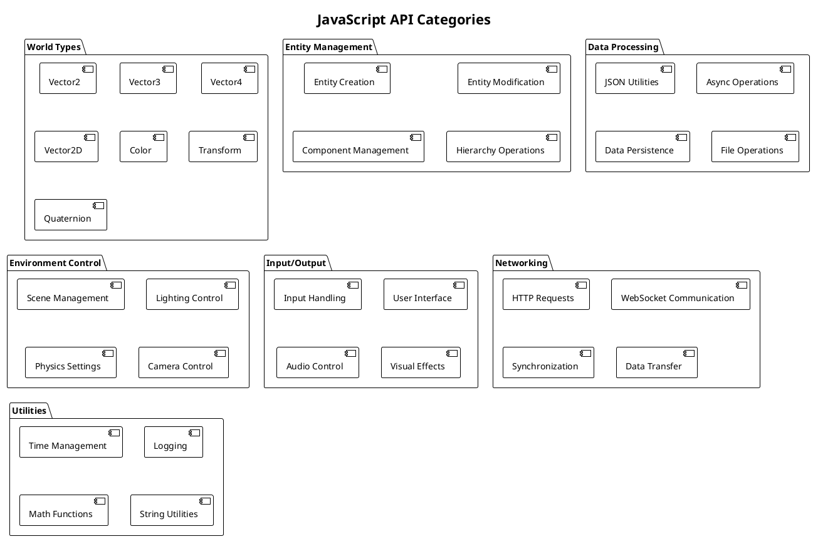
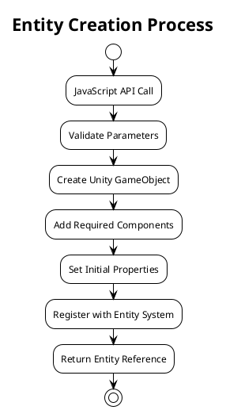

# JavaScript API Reference

This document provides comprehensive documentation for the JavaScript APIs exposed by WebVerse-Runtime, including all available functions, parameters, return values, and usage examples.

## API Overview

The WebVerse-Runtime JavaScript APIs provide a comprehensive interface for creating and manipulating virtual environments. The APIs are organized into several categories:



## World Types

### Vector2

Represents a 2D vector with x and y components.

```javascript
// Constructor
var vector2 = new Vector2(x, y);

// Static methods
Vector2.zero;           // Returns (0, 0)
Vector2.one;            // Returns (1, 1)
Vector2.up;             // Returns (0, 1)
Vector2.down;           // Returns (0, -1)
Vector2.left;           // Returns (-1, 0)
Vector2.right;          // Returns (1, 0)

// Instance properties
vector2.x;              // X component
vector2.y;              // Y component
vector2.magnitude;      // Length of vector
vector2.sqrMagnitude;   // Squared length (faster)
vector2.normalized;     // Unit vector in same direction

// Instance methods
vector2.Normalize();    // Normalize in place
vector2.Set(x, y);      // Set components
vector2.ToString();     // String representation

// Static operations
Vector2.Distance(a, b);     // Distance between vectors
Vector2.Dot(a, b);          // Dot product
Vector2.Angle(from, to);    // Angle between vectors
Vector2.Lerp(a, b, t);      // Linear interpolation
```

**Example Usage:**
```javascript
// Create position vector
var position = new Vector2(10, 5);

// Calculate distance to target
var target = new Vector2(20, 15);
var distance = Vector2.Distance(position, target);

// Move towards target
var newPosition = Vector2.Lerp(position, target, 0.1);
```

### Vector3

Represents a 3D vector with x, y, and z components.

```javascript
// Constructor
var vector3 = new Vector3(x, y, z);

// Static methods
Vector3.zero;           // Returns (0, 0, 0)
Vector3.one;            // Returns (1, 1, 1)
Vector3.up;             // Returns (0, 1, 0)
Vector3.down;           // Returns (0, -1, 0)
Vector3.left;           // Returns (-1, 0, 0)
Vector3.right;          // Returns (1, 0, 0)
Vector3.forward;        // Returns (0, 0, 1)
Vector3.back;           // Returns (0, 0, -1)

// Static operations
Vector3.Cross(a, b);        // Cross product
Vector3.Distance(a, b);     // Distance between vectors
Vector3.Dot(a, b);          // Dot product
Vector3.Lerp(a, b, t);      // Linear interpolation
Vector3.Slerp(a, b, t);     // Spherical interpolation
Vector3.Project(vector, onNormal);  // Project vector onto plane
```

**Example Usage:**
```javascript
// Create 3D position
var position = new Vector3(1, 2, 3);

// Calculate forward direction
var forward = Vector3.forward;
var right = Vector3.Cross(forward, Vector3.up);

// Smooth movement
var targetPosition = new Vector3(10, 0, 10);
var smoothPosition = Vector3.Lerp(position, targetPosition, 0.05);
```

### Color

Represents RGBA color values.

```javascript
// Constructor
var color = new Color(r, g, b, a);  // Values 0-1
var color = new Color(r, g, b);     // Alpha defaults to 1

// Static colors
Color.white;
Color.black;
Color.red;
Color.green;
Color.blue;
Color.yellow;
Color.cyan;
Color.magenta;
Color.gray;
Color.clear;

// Properties
color.r;    // Red component (0-1)
color.g;    // Green component (0-1)
color.b;    // Blue component (0-1)
color.a;    // Alpha component (0-1)

// Methods
color.ToString();           // String representation
Color.Lerp(a, b, t);       // Interpolate between colors
Color.HSVToRGB(h, s, v);   // Convert HSV to RGB
Color.RGBToHSV(color);     // Convert RGB to HSV
```

**Example Usage:**
```javascript
// Create custom color
var customColor = new Color(0.8, 0.2, 0.4, 1.0);

// Animate color over time
var startColor = Color.red;
var endColor = Color.blue;
var animatedColor = Color.Lerp(startColor, endColor, animationTime);

// Create transparent color
var transparentRed = new Color(1, 0, 0, 0.5);
```

### Transform

Represents position, rotation, and scale in 3D space.

```javascript
// Properties
transform.position;         // Vector3 position
transform.rotation;         // Quaternion rotation
transform.localPosition;    // Vector3 local position
transform.localRotation;    // Quaternion local rotation
transform.localScale;       // Vector3 scale
transform.forward;          // Forward direction vector
transform.right;            // Right direction vector
transform.up;              // Up direction vector

// Methods
transform.Translate(translation);           // Move by offset
transform.Rotate(eulerAngles);             // Rotate by angles
transform.RotateAround(point, axis, angle); // Rotate around point
transform.LookAt(target);                   // Face target
transform.SetParent(parent);               // Set parent transform

// Direction methods
transform.TransformDirection(direction);    // Local to world direction
transform.InverseTransformDirection(direction); // World to local direction
transform.TransformPoint(position);        // Local to world position
transform.InverseTransformPoint(position); // World to local position
```

**Example Usage:**
```javascript
// Move object forward
var moveSpeed = 5.0;
var moveDirection = transform.forward;
transform.position = Vector3.Add(transform.position, 
    Vector3.Scale(moveDirection, moveSpeed * Time.deltaTime));

// Look at target
var target = new Vector3(10, 0, 10);
transform.LookAt(target);

// Scale object
transform.localScale = new Vector3(2, 2, 2);
```

## Entity Management

### Entity Creation

```javascript
// Create basic entity
var entity = Entity.create();
var entity = Entity.create("EntityName");
var entity = Entity.create("EntityName", parentEntity);

// Create entity with transform
var transform = {
    position: new Vector3(0, 1, 0),
    rotation: Quaternion.identity,
    scale: Vector3.one
};
var entity = Entity.createWithTransform("EntityName", transform);

// Create specific entity types
var meshEntity = MeshEntity.create();
var lightEntity = LightEntity.create();
var textEntity = TextEntity.create();
var buttonEntity = ButtonEntity.create();
var containerEntity = ContainerEntity.create();
```

**Entity Creation Flow:**


### Entity Properties

```javascript
// Basic properties
entity.id;              // Unique identifier
entity.name;            // Display name
entity.tag;             // Tag for categorization
entity.layer;           // Rendering layer
entity.active;          // Active state

// Transform properties
entity.position;        // World position
entity.rotation;        // World rotation
entity.localPosition;   // Local position
entity.localRotation;   // Local rotation
entity.localScale;      // Local scale

// Hierarchy properties
entity.parent;          // Parent entity
entity.children;        // Array of child entities
entity.childCount;      // Number of children

// Component access
entity.transform;       // Transform component
entity.renderer;        // Renderer component (if any)
entity.collider;        // Collider component (if any)
entity.rigidbody;       // Rigidbody component (if any)
```

### Entity Methods

```javascript
// Lifecycle methods
entity.destroy();                   // Destroy entity
entity.setActive(active);          // Set active state
entity.isActive();                 // Check active state

// Hierarchy methods
entity.setParent(parent);          // Set parent entity
entity.addChild(child);            // Add child entity
entity.removeChild(child);         // Remove child entity
entity.getChild(index);            // Get child by index
entity.findChild(name);            // Find child by name

// Component methods
entity.addComponent(componentType); // Add component
entity.getComponent(componentType); // Get component
entity.hasComponent(componentType); // Check component existence
entity.removeComponent(componentType); // Remove component

// Property methods
entity.setProperty(name, value);    // Set custom property
entity.getProperty(name);           // Get custom property
entity.hasProperty(name);           // Check property existence
entity.removeProperty(name);        // Remove property
```

**Example Usage:**
```javascript
// Create and configure entity
var playerEntity = Entity.create("Player");
playerEntity.position = new Vector3(0, 0, 0);
playerEntity.setProperty("health", 100);
playerEntity.setProperty("level", 1);

// Create child entity
var weaponEntity = Entity.create("Weapon", playerEntity);
weaponEntity.localPosition = new Vector3(1, 0, 0);

// Add components
playerEntity.addComponent("Rigidbody");
playerEntity.addComponent("Collider");

// Check properties
if (playerEntity.hasProperty("health")) {
    var health = playerEntity.getProperty("health");
    Logging.Log("Player health: " + health);
}
```

## Mesh Entities

### MeshEntity Properties

```javascript
// Mesh properties
meshEntity.mesh;            // Mesh asset reference
meshEntity.materials;       // Array of materials
meshEntity.bounds;          // Mesh bounds
meshEntity.vertexCount;     // Number of vertices
meshEntity.triangleCount;   // Number of triangles

// Rendering properties
meshEntity.lightmapIndex;   // Lightmap index
meshEntity.sortingOrder;    // Rendering order
```

### MeshEntity Methods

```javascript
// Mesh operations
meshEntity.setMesh(meshData);           // Set mesh data
meshEntity.setMaterial(material);       // Set single material
meshEntity.setMaterials(materials);     // Set multiple materials
meshEntity.getMaterial(index);          // Get material by index

// Rendering operations
meshEntity.updateBounds();              // Recalculate bounds

// Mesh generation
meshEntity.createPrimitive(type);       // Create primitive mesh
meshEntity.createFromVertices(vertices, triangles); // Custom mesh
```

**Example Usage:**
```javascript
// Create mesh entity
var meshEntity = MeshEntity.create("CustomMesh");

// Load mesh from file
meshEntity.setMesh("models/character.gltf");

// Set materials
var material1 = { color: Color.red, metallic: 0.5 };
var material2 = { color: Color.blue, roughness: 0.3 };
meshEntity.setMaterials([material1, material2]);
```

## Light Entities

### LightEntity Properties

```javascript
// Light properties
lightEntity.type;           // Light type (directional, point, spot)
lightEntity.color;          // Light color
lightEntity.intensity;      // Light intensity
lightEntity.range;          // Light range (point/spot lights)
lightEntity.angle;          // Spot light angle
```

### LightEntity Methods

```javascript
// Light configuration
lightEntity.setType(lightType);        // Set light type
lightEntity.setColor(color);           // Set light color
lightEntity.setIntensity(intensity);   // Set intensity
lightEntity.setRange(range);           // Set range
lightEntity.setAngle(angle);           // Set spot angle
```

**Example Usage:**
```javascript
// Create directional light (sun)
var sunLight = LightEntity.create("Sun");
sunLight.setType("Directional");
sunLight.setColor(new Color(1, 0.95, 0.8));
sunLight.setIntensity(1.5);
sunLight.rotation = Quaternion.Euler(50, -30, 0);

// Create point light
var lampLight = LightEntity.create("Lamp");
lampLight.setType("Point");
lampLight.setColor(Color.white);
lampLight.setIntensity(2.0);
lampLight.setRange(10.0);
lampLight.position = new Vector3(0, 3, 0);
```

## Data Processing APIs

### JSON Utilities

```javascript
// Synchronous JSON operations
var jsonString = JSON.stringify(object);
var object = JSON.parse(jsonString);

// Asynchronous JSON operations
AsyncJSON.parseAsync(jsonString, function(result) {
    if (result.success) {
        var object = result.data;
        // Use parsed object
    } else {
        Logging.LogError("JSON parse error: " + result.error);
    }
});

AsyncJSON.stringifyAsync(object, function(result) {
    if (result.success) {
        var jsonString = result.data;
        // Use JSON string
    } else {
        Logging.LogError("JSON stringify error: " + result.error);
    }
});
```

### Data Persistence

```javascript
// Local storage operations
LocalStorage.setItem(key, value);       // Store data
var value = LocalStorage.getItem(key);  // Retrieve data
LocalStorage.removeItem(key);           // Remove data
LocalStorage.clear();                   // Clear all data

// Check storage
var exists = LocalStorage.hasItem(key); // Check existence
var keys = LocalStorage.getAllKeys();   // Get all keys
var size = LocalStorage.getSize();      // Get storage size

// Storage events
LocalStorage.onItemSet = function(key, value) {
    Logging.Log("Item set: " + key);
};

LocalStorage.onItemRemoved = function(key) {
    Logging.Log("Item removed: " + key);
};
```

**Example Usage:**
```javascript
// Save player data
var playerData = {
    name: "Player1",
    level: 5,
    score: 1500,
    inventory: ["sword", "potion", "key"]
};

LocalStorage.setItem("playerData", JSON.stringify(playerData));

// Load player data
var savedData = LocalStorage.getItem("playerData");
if (savedData) {
    var playerData = JSON.parse(savedData);
    Logging.Log("Loaded player: " + playerData.name);
}
```

## Environment Control

### Scene Management

```javascript
// Scene operations
World.loadScene(sceneName);             // Load scene
World.unloadScene(sceneName);           // Unload scene
World.getActiveScene();                 // Get active scene
World.setActiveScene(sceneName);        // Set active scene

// Scene properties
var sceneName = World.getSceneName();   // Current scene name
var isLoaded = World.isSceneLoaded(sceneName); // Check if loaded
var sceneCount = World.getLoadedSceneCount();   // Number of loaded scenes

// Scene events
World.onSceneLoaded = function(sceneName) {
    Logging.Log("Scene loaded: " + sceneName);
};

World.onSceneUnloaded = function(sceneName) {
    Logging.Log("Scene unloaded: " + sceneName);
};
```

### Lighting Control

```javascript
// Environment lighting
Environment.setSkybox(skyboxMaterial);      // Set skybox
Environment.setAmbientColor(color);        // Set ambient color
Environment.setAmbientIntensity(intensity); // Set ambient intensity

// Fog settings
Environment.setFogEnabled(enabled);        // Enable/disable fog
Environment.setFogColor(color);           // Set fog color
Environment.setFogDensity(density);       // Set fog density
Environment.setFogDistance(start, end);   // Set fog distance

// Post-processing effects
Environment.setBloomEnabled(enabled);      // Enable bloom
Environment.setBloomIntensity(intensity);  // Set bloom intensity
Environment.setColorGrading(settings);     // Set color grading
```

**Example Usage:**
```javascript
// Configure environment lighting
Environment.setAmbientColor(new Color(0.2, 0.3, 0.4));
Environment.setAmbientIntensity(0.5);

// Set up atmospheric fog
Environment.setFogEnabled(true);
Environment.setFogColor(new Color(0.8, 0.9, 1.0));
Environment.setFogDensity(0.01);

// Enable post-processing
Environment.setBloomEnabled(true);
Environment.setBloomIntensity(0.3);
```

## Input Handling

### Input Events

```javascript
// Mouse events
Input.onMouseDown = function(button, position) {
    Logging.Log("Mouse down: " + button + " at " + position);
};

Input.onMouseUp = function(button, position) {
    Logging.Log("Mouse up: " + button + " at " + position);
};

Input.onMouseMove = function(position, delta) {
    // Handle mouse movement
};

// Keyboard events
Input.onKeyDown = function(key) {
    Logging.Log("Key pressed: " + key);
};

Input.onKeyUp = function(key) {
    Logging.Log("Key released: " + key);
};

// Touch events (mobile)
Input.onTouchStart = function(touch) {
    Logging.Log("Touch started at: " + touch.position);
};

Input.onTouchEnd = function(touch) {
    Logging.Log("Touch ended");
};
```

### Input State Queries

```javascript
// Mouse state
var mousePos = Input.getMousePosition();
var isLeftPressed = Input.isMouseButtonPressed(0);
var isRightPressed = Input.isMouseButtonPressed(1);
var scrollDelta = Input.getMouseScrollDelta();

// Keyboard state
var isKeyPressed = Input.isKeyPressed("Space");
var isShiftPressed = Input.isKeyPressed("LeftShift");
var inputString = Input.getInputString(); // Text input

// Touch state (mobile)
var touchCount = Input.getTouchCount();
var touch = Input.getTouch(0); // First touch
```

**Example Usage:**
```javascript
// Handle player movement
Input.onKeyDown = function(key) {
    switch(key) {
        case "W":
            player.moveForward();
            break;
        case "S":
            player.moveBackward();
            break;
        case "A":
            player.moveLeft();
            break;
        case "D":
            player.moveRight();
            break;
        case "Space":
            player.jump();
            break;
    }
};

// Handle mouse look
Input.onMouseMove = function(position, delta) {
    var sensitivity = 2.0;
    camera.rotate(delta.x * sensitivity, delta.y * sensitivity);
};
```

## Networking APIs

### HTTP Requests

```javascript
// GET request
HTTP.get(url, function(response) {
    if (response.success) {
        var data = response.data;
        Logging.Log("Received data: " + data);
    } else {
        Logging.LogError("HTTP error: " + response.error);
    }
});

// POST request
var postData = { name: "John", age: 30 };
HTTP.post(url, postData, function(response) {
    if (response.success) {
        Logging.Log("POST successful");
    } else {
        Logging.LogError("POST failed: " + response.error);
    }
});

// Request with headers
var headers = { "Authorization": "Bearer token123" };
HTTP.getWithHeaders(url, headers, function(response) {
    // Handle response
});
```

### WebSocket Communication

```javascript
// Connect to WebSocket
var ws = new WebSocket("ws://localhost:8080");

// Connection events
ws.onOpen = function() {
    Logging.Log("WebSocket connected");
    ws.send("Hello Server!");
};

ws.onMessage = function(message) {
    Logging.Log("Received: " + message);
    var data = JSON.parse(message);
    // Handle message data
};

ws.onClose = function() {
    Logging.Log("WebSocket disconnected");
};

ws.onError = function(error) {
    Logging.LogError("WebSocket error: " + error);
};

// Send data
ws.send(JSON.stringify({ type: "update", data: someData }));

// Close connection
ws.close();
```

## Utility APIs

### Time Management

```javascript
// Time properties
var currentTime = Time.time;           // Time since start
var deltaTime = Time.deltaTime;        // Time since last frame
var timeScale = Time.timeScale;        // Time scale multiplier
var frameCount = Time.frameCount;      // Current frame number

// Time methods
Time.setTimeScale(scale);              // Set time scale
var realTime = Time.realtimeSinceStartup; // Real time

// Scheduling
Time.setTimeout(function() {
    Logging.Log("Timeout executed");
}, 1000); // Execute after 1 second

Time.setInterval(function() {
    Logging.Log("Interval tick");
}, 500); // Execute every 0.5 seconds

// Date and time
var now = Date.now();                  // Current timestamp
var dateString = Date.toString();      // Current date as string
```

### Logging

```javascript
// Log levels
Logging.Log("Info message");           // Information
Logging.LogWarning("Warning message"); // Warning
Logging.LogError("Error message");     // Error

// Conditional logging
Logging.LogIf(condition, "Conditional message");
Logging.Assert(condition, "Assertion failed");

// Log with context
Logging.LogWithContext("Message", "Context");

// Log formatting
Logging.LogFormat("Player {0} scored {1} points", playerName, score);
```

### Math Functions

```javascript
// Basic math
var result = Math.abs(value);          // Absolute value
var result = Math.min(a, b);           // Minimum
var result = Math.max(a, b);           // Maximum
var result = Math.clamp(value, min, max); // Clamp value

// Trigonometry
var sin = Math.sin(angle);             // Sine
var cos = Math.cos(angle);             // Cosine
var tan = Math.tan(angle);             // Tangent
var atan2 = Math.atan2(y, x);         // Arc tangent

// Interpolation
var lerp = Math.lerp(a, b, t);         // Linear interpolation
var smoothstep = Math.smoothstep(edge0, edge1, x); // Smooth interpolation

// Random
var random = Math.random();            // Random 0-1
var randomRange = Math.randomRange(min, max); // Random in range
var randomInt = Math.randomInt(min, max);     // Random integer
```

**Example Usage:**
```javascript
// Smooth object movement
function updateMovement() {
    var targetPosition = getTargetPosition();
    var currentPosition = entity.position;
    var smoothPosition = Vector3.Lerp(currentPosition, targetPosition, 
        Time.deltaTime * moveSpeed);
    entity.position = smoothPosition;
}

// Random color generation
function getRandomColor() {
    return new Color(
        Math.random(),
        Math.random(), 
        Math.random(),
        1.0
    );
}

// Distance-based interaction
function checkInteractionDistance(player, object) {
    var distance = Vector3.Distance(player.position, object.position);
    var maxDistance = 5.0;
    return distance <= maxDistance;
}
```

This JavaScript API provides comprehensive access to WebVerse-Runtime functionality, enabling rich interactive experiences and dynamic content creation within virtual environments.