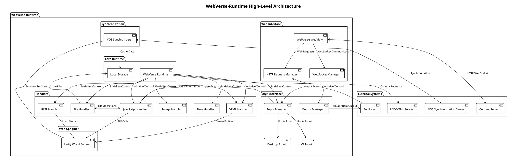
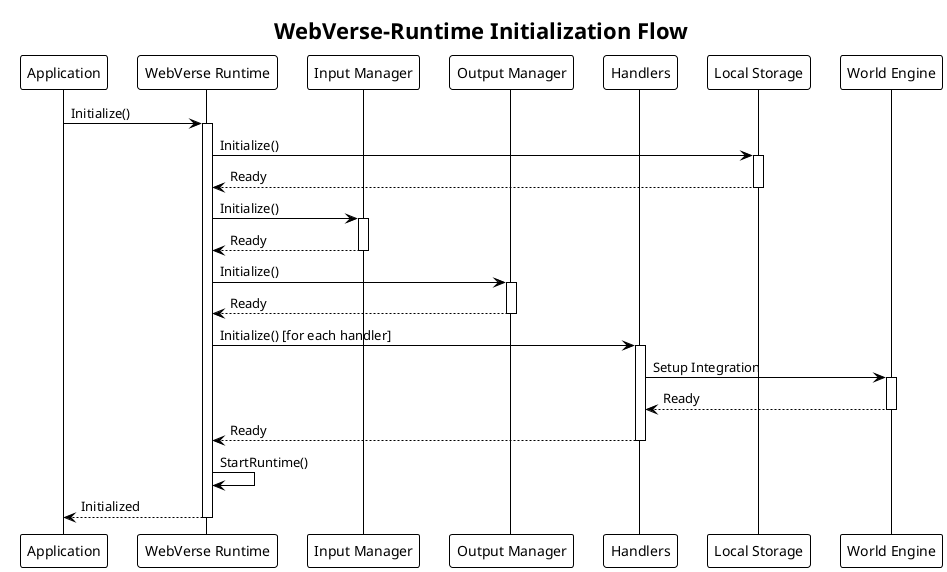
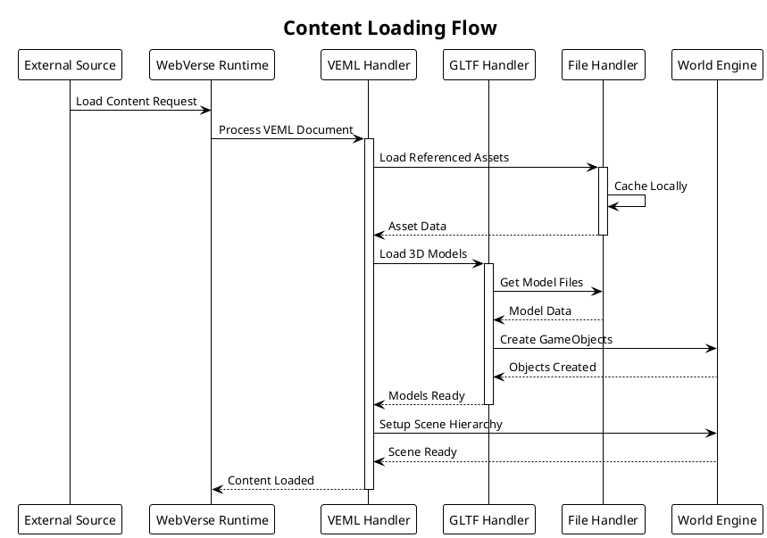
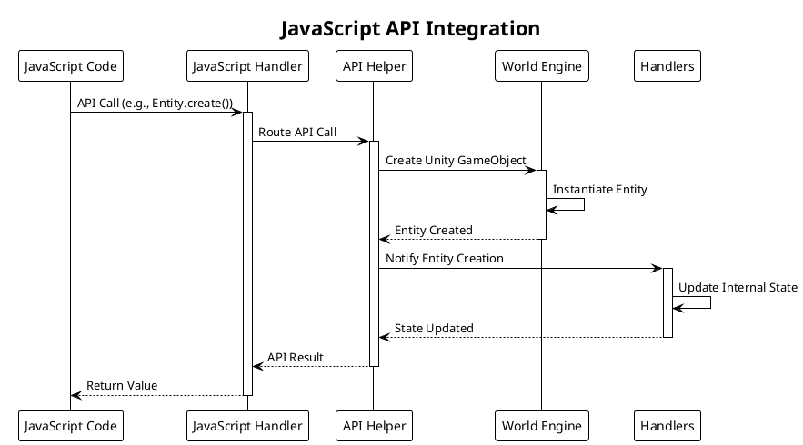
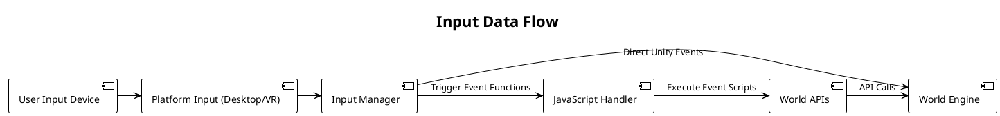
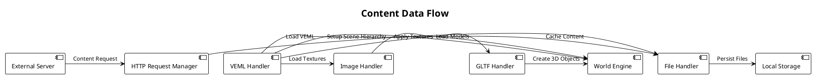

# System Architecture

This document provides a comprehensive overview of the WebVerse-Runtime architecture, including system components, design principles, and interaction patterns.

## High-Level Architecture

## Design Principles

### 1. Modular Handler Architecture

The system employs a modular architecture where specialized handlers manage different types of content and functionality:

- **Separation of Concerns**: Each handler focuses on a specific responsibility
- **Pluggable Design**: Handlers can be added, removed, or replaced without affecting others
- **Standardized Interface**: All handlers inherit from `BaseHandler` providing consistent lifecycle management

### 2. Event-Driven Communication

Components communicate through an event-driven system that promotes loose coupling:

- **Input Events**: User interactions trigger events processed by the Input Manager
- **JavaScript Events**: Script execution triggers events handled by appropriate systems
- **Synchronization Events**: Network events update local state through VOS synchronizers

### 3. Unity Integration

Deep integration with Unity3D provides:

- **GameObjects Architecture**: Each major component is represented as Unity GameObjects
- **Unity Lifecycle**: Components follow Unity's initialization and update patterns
- **Scene Management**: Integration with Unity's scene system for content organization

## Core Components

### WebVerse Runtime (Core)

The central orchestrator responsible for:

- **Component Initialization**: Setting up all handlers and managers in proper order
- **Lifecycle Management**: Coordinating startup, runtime, and shutdown phases
- **Configuration Management**: Handling runtime configuration and settings
- **Error Handling**: Centralized error handling and logging

**Key Methods:**
- `InitializeComponents()`: Sets up all system components
- `StartRuntime()`: Begins runtime execution
- `Terminate()`: Cleanly shuts down all systems

### Handler System

Specialized handlers manage different content types and functionality:

#### Content Handlers
- **VEML Handler**: Processes Virtual Environment Markup Language files
- **GLTF Handler**: Loads and manages 3D models and scenes
- **Image Handler**: Processes and manages image assets
- **File Handler**: Manages file system operations and caching

#### Execution Handlers
- **JavaScript Handler**: Executes JavaScript code and exposes APIs
- **Time Handler**: Manages timing and scheduling operations

### Manager System

Managers handle cross-cutting concerns:

#### Input/Output Managers
- **Input Manager**: Processes and routes input events from various sources
- **Output Manager**: Manages visual and audio output to users

#### Storage and Networking
- **Local Storage Manager**: Handles local data persistence
- **HTTP Request Manager**: Manages HTTP communications
- **WebSocket Manager**: Handles real-time communication

### Synchronization System

Enables multi-user and distributed scenarios:

- **VOS Synchronizers**: Maintain state consistency across clients
- **Synchronization Manager**: Coordinates synchronization operations
- **Message Handling**: Processes synchronization messages and updates

## Component Interaction Patterns

### Initialization Flow

### Content Loading Flow

### JavaScript API Integration

## Data Flow Architecture

### Input Processing

### Content Data Flow

## Performance Considerations

### Asynchronous Operations

- **Content Loading**: All content loading operations are performed asynchronously
- **File I/O**: File operations use Unity's async APIs
- **Network Requests**: HTTP and WebSocket operations are non-blocking

### Memory Management

- **Asset Caching**: Intelligent caching reduces memory usage
- **Garbage Collection**: Minimal allocations in update loops
- **Resource Cleanup**: Proper disposal of resources when no longer needed

### Threading Model

- **Main Thread**: Unity's main thread handles GameObject operations
- **Background Threads**: File I/O and network operations use background threads
- **JavaScript Execution**: JavaScript runs on the main thread with controlled execution time

## Security Architecture

### JavaScript Sandboxing

- **API Limitations**: JavaScript APIs are restricted to safe operations
- **File System Access**: Limited to designated directories
- **Network Access**: Controlled through request managers

### Content Validation

- **VEML Validation**: Schema validation for VEML documents
- **Asset Validation**: File type and size validation
- **Script Validation**: JavaScript code validation before execution

## Extensibility Points

### Custom Handlers

The architecture supports custom handlers through:

- **BaseHandler Interface**: Inherit from BaseHandler for lifecycle management
- **Registration System**: Register custom handlers with the runtime
- **API Integration**: Expose custom functionality through JavaScript APIs

### Plugin Architecture

- **Assembly Definition Files**: Use Unity's asmdef system for modular plugins
- **Dependency Injection**: Handlers can depend on other handlers
- **Configuration System**: Plugin-specific configuration support

This architecture provides a robust, scalable foundation for virtual world experiences while maintaining flexibility for customization and extension.