# Component Overview

This document provides detailed information about each major component in the WebVerse-Runtime system, including their responsibilities, interfaces, and implementation details.

## Core Runtime Components

### WebVerseRuntime

**Location**: `Assets/Runtime/Runtime/Scripts/WebVerseRuntime.cs`
**Inherits**: `MonoBehaviour`

The main orchestrator for the entire WebVerse-Runtime system.

#### Responsibilities
- Component lifecycle management
- Runtime configuration
- Error handling and logging coordination
- Scene management integration

#### Key Properties
```csharp
public LocalStorageManager localStorageManager;
public InputManager inputManager;
public OutputManager outputManager;
public HTTPRequestManager httpRequestManager;
public WebVerseWebView webverseWebView;
```

#### Component Initialization Flow
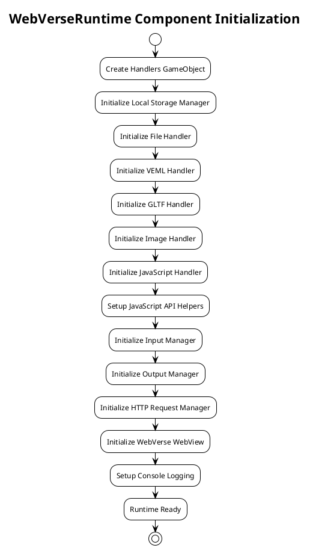

#### Configuration
- Storage mode (Persistent/Cache)
- File directories
- Timeout settings
- Handler-specific configurations

## Handler Components

### BaseHandler

**Location**: `Assets/Runtime/Utilities/Scripts/BaseHandler.cs`
**Type**: Abstract Base Class

Provides common functionality for all handlers in the system.

#### Standard Interface
```csharp
public abstract class BaseHandler : MonoBehaviour
{
    public virtual void Initialize();
    public virtual void Terminate();
    protected bool isInitialized;
}
```

### FileHandler

**Location**: `Assets/Runtime/Handlers/FileHandler/Scripts/FileHandler.cs`
**Inherits**: `BaseHandler`

Manages file system operations and local file caching.

#### Responsibilities
- Local file storage management
- Directory structure creation
- File existence checking
- Image file operations

#### Key Methods
```csharp
public void Initialize(string fileDirectory);
public bool FileExistsInFileDirectory(string fileName);
public void CreateFileInFileDirectory(string fileName, Texture2D image);
public void CreateDirectoryStructure(string fileName);
```

#### File Operations Flow
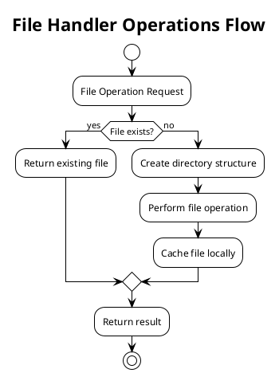

### VEMLHandler

**Location**: `Assets/Runtime/Handlers/VEMLHandler/`

Processes Virtual Environment Markup Language documents and converts them to Unity scene hierarchies.

#### Responsibilities
- VEML document parsing
- Schema version conversion (V2.3, V2.4, V3.0)
- Entity creation and hierarchy setup
- Asset reference resolution

#### Schema Support
- **VEML 3.0**: Current primary schema
- **VEML 2.4**: Legacy support with automatic conversion
- **VEML 2.3**: Legacy support with automatic conversion

#### VEML Processing Flow
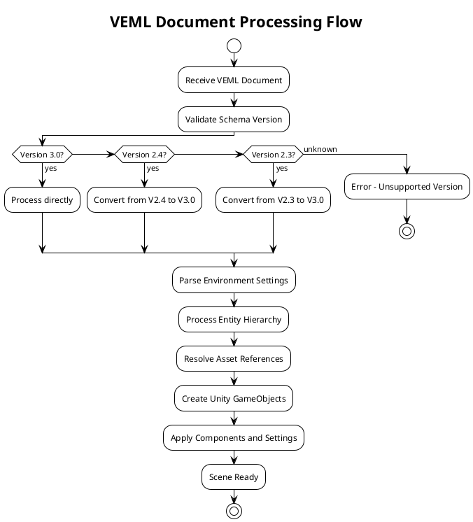

### GLTFHandler

**Location**: `Assets/Runtime/Handlers/GLTFHandler/`

Handles loading and processing of GLTF (GL Transmission Format) 3D models.

#### Responsibilities
- GLTF model loading
- Texture and material application
- Animation setup
- Scene hierarchy integration

#### GLTF Import Pipeline
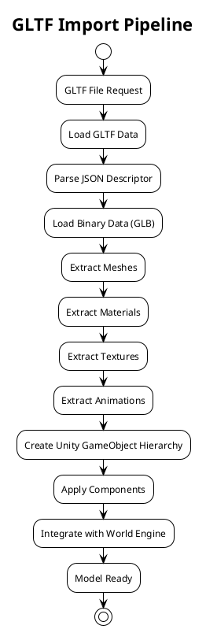

### JavaScriptHandler

**Location**: `Assets/Runtime/Handlers/JavascriptHandler/Scripts/JavascriptHandler.cs`
**Inherits**: `BaseHandler`

Executes JavaScript code and provides API integration with Unity systems.

#### Responsibilities
- JavaScript code execution
- API exposure to JavaScript
- Event handling and callbacks
- Bridge between scripts and Unity

#### API Categories
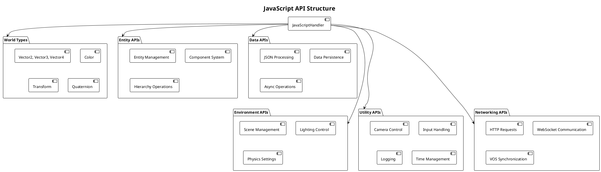

#### JavaScript Execution Model
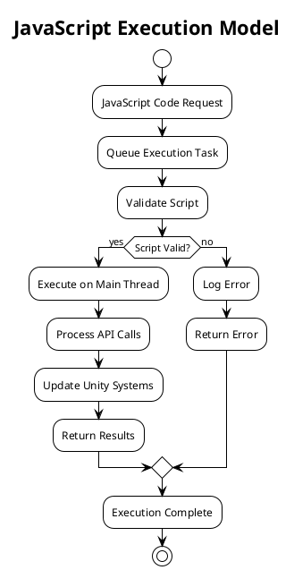

### ImageHandler

**Location**: `Assets/Runtime/Handlers/ImageHandler/`

Manages image loading, processing, and texture creation.

#### Responsibilities
- Image file loading (PNG, JPG, etc.)
- Texture2D creation
- Image format conversion
- Texture memory management

### TimeHandler

**Location**: `Assets/Runtime/Handlers/TimeHandler/`

Provides time-related functionality and scheduling services.

#### Responsibilities
- Time synchronization
- Scheduled task execution
- Timer management
- Time zone handling

## Manager Components

### InputManager

**Location**: `Assets/Runtime/UserInterface/Input/Scripts/InputManager.cs`
**Inherits**: `BaseManager`

Processes and routes input events from various input sources.

#### Input Sources
- Desktop (Mouse, Keyboard)
- VR Controllers
- Touch Input
- Custom Input Devices

#### Input Event Flow
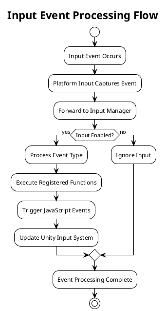

#### Input Function Registration
- Left/Right/Middle mouse functions
- Key and KeyCode functions
- VR controller functions
- Touch gesture functions

### OutputManager

**Location**: `Assets/Runtime/UserInterface/Output/Scripts/OutputManager.cs`
**Inherits**: `BaseManager`

Manages visual and audio output to users.

#### Responsibilities
- Screen resolution management
- Display configuration
- Output device management
- Performance monitoring

#### Screen Management
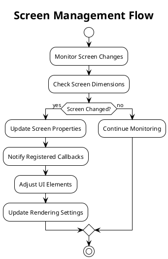

### LocalStorageManager

**Location**: `Assets/Runtime/LocalStorage/LocalStorageManager/Scripts/LocalStorageManager.cs`

Provides local data persistence with multiple storage strategies.

#### Storage Controllers
- **PersistentStorageController**: Long-term data persistence
- **CacheStorageController**: Temporary data caching
- **BaseStorageController**: Common storage interface

#### Storage Operations
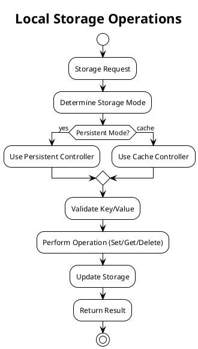

## Synchronization Components

### VOSSynchronizer

**Location**: `Assets/Runtime/VOSSynchronizer/Scripts/VOSSynchronizer.cs`

Handles synchronization with Virtual Operating System (VOS) services.

#### Responsibilities
- State synchronization
- Message processing
- Conflict resolution
- Network communication

#### Synchronization Flow
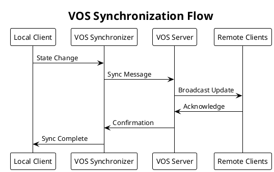

### VOSSynchronizationManager

**Location**: `Assets/Runtime/VOSSynchronizer/Scripts/VOSSynchronizationManager.cs`

Coordinates multiple synchronizers and manages synchronization policies.

#### Management Functions
- Synchronizer registration
- Policy enforcement
- Conflict resolution
- Performance monitoring

## Web Interface Components

### WebVerseWebView

Provides web browser functionality within the Unity environment.

#### Capabilities
- HTML rendering
- JavaScript execution
- DOM manipulation
- Web API access

### HTTPRequestManager

Manages HTTP communication with external services.

#### Features
- Asynchronous requests
- Request queuing
- Error handling
- Response caching

#### HTTP Request Flow
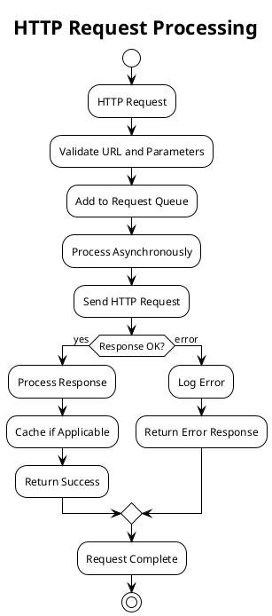

## Platform-Specific Components

### DesktopInput

**Location**: `Assets/Runtime/UserInterface/Input/Desktop/Scripts/DesktopInput.cs`
**Inherits**: `BasePlatformInput`

Handles desktop-specific input (mouse, keyboard).

#### Input Mapping
- Mouse clicks (Left, Right, Middle)
- Mouse movement and scroll
- Keyboard input
- Keyboard shortcuts

#### Desktop Input Processing
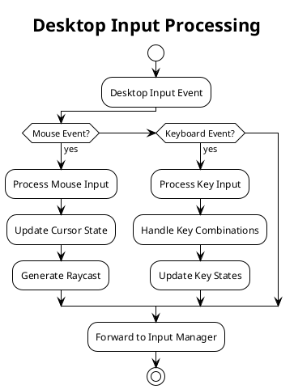

### VR Input Components

Handle VR-specific input from controllers and headsets.

#### VR Input Features
- 6DOF tracking
- Controller button mapping
- Gesture recognition
- Haptic feedback

## Utility Components

### BaseManager

**Location**: `Assets/Runtime/Utilities/Scripts/BaseManager.cs`

Base class for all manager components providing common functionality.

### BaseController

**Location**: `Assets/Runtime/Utilities/Scripts/BaseController.cs`

Base class for controller components.

### Logging

**Location**: `Assets/Runtime/Utilities/Scripts/Logging.cs`

Centralized logging system for the entire runtime.

#### Logging Features
- Multiple log levels (Info, Warning, Error)
- Category-based filtering
- Console integration
- File output support

## Component Integration Patterns

### Dependency Injection

Components can declare dependencies on other components:

```csharp
[RequireComponent(typeof(FileHandler))]
public class VEMLHandler : BaseHandler
{
    private FileHandler fileHandler;
    
    public override void Initialize()
    {
        fileHandler = GetComponent<FileHandler>();
        // ... initialization logic
    }
}
```

### Event-Based Communication

Components communicate through events to maintain loose coupling:

```csharp
public class InputManager : BaseManager
{
    public event Action<InputEvent> OnInputEvent;
    
    private void ProcessInput()
    {
        OnInputEvent?.Invoke(inputEvent);
    }
}
```

### Service Locator Pattern

Global services are accessible through static references:

```csharp
public static class WebVerseRuntime
{
    public static Instance { get; private set; }
    public InputManager inputManager;
    public OutputManager outputManager;
    // ... other managers
}
```

## Performance Considerations

### Component Lifecycle

- **Lazy Initialization**: Components initialize only when needed
- **Proper Disposal**: Components clean up resources in Terminate()
- **Memory Management**: Minimize allocations in Update() methods

### Threading Model

- **Main Thread**: Unity operations and GameObject manipulation
- **Background Threads**: File I/O, network operations, and heavy computations
- **Thread Safety**: Proper synchronization for shared resources

### Scalability Features

- **Object Pooling**: Reuse of GameObjects and components
- **LOD System**: Level-of-detail for complex scenes
- **Culling**: Frustum and occlusion culling for performance

This component overview provides the foundation for understanding how WebVerse-Runtime components work together to create immersive virtual environments.