# Data Flow Architecture

This document describes how data flows through the WebVerse-Runtime system, including content loading, user interactions, synchronization, and API communications.

## Overview

The WebVerse-Runtime system processes multiple types of data flows simultaneously:

- **Content Data**: VEML documents, 3D models, images, and other assets
- **User Input Data**: Mouse, keyboard, VR controller, and touch inputs
- **Synchronization Data**: Multi-user state updates and conflict resolution
- **API Data**: JavaScript API calls and responses
- **Network Data**: HTTP requests, WebSocket messages, and file transfers

## Content Data Flow

### VEML Content Processing

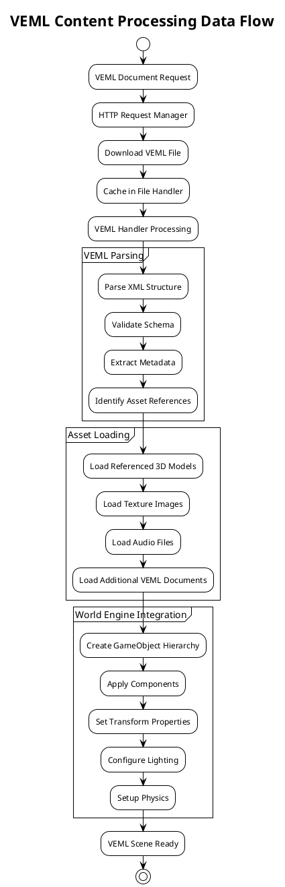

### Asset Dependency Resolution

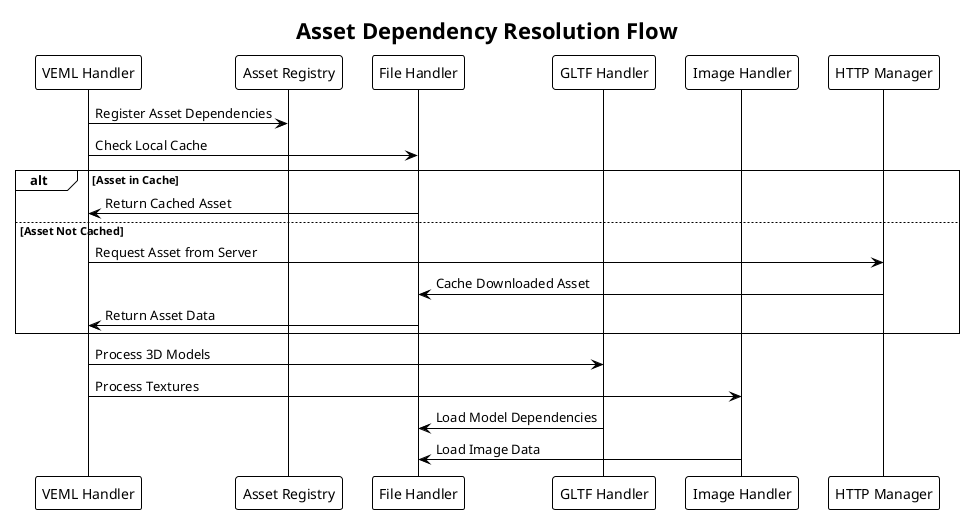

## Input Data Flow

### Input Event Processing Pipeline

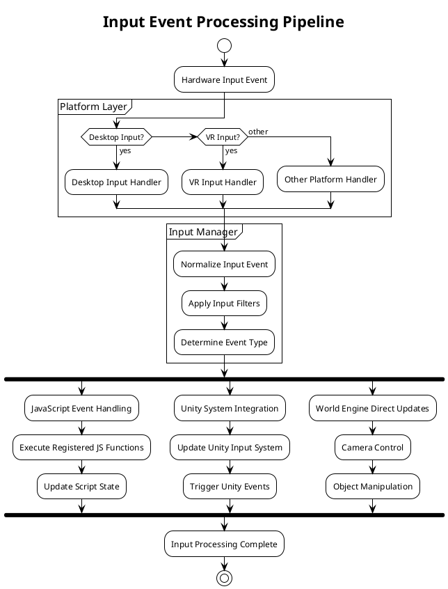

### Input Data Transformation

```plantuml
@startuml Input-Data-Transformation
!theme plain

title Input Data Transformation Flow

[Raw Hardware Input] -> [Platform Specific Handler] : Native Input Events
[Platform Specific Handler] -> [Input Normalization] : Standardized Input Data
[Input Normalization] -> [Input Manager] : Processed Input Events

[Input Manager] -> [JavaScript Functions] : Event Callbacks
[Input Manager] -> [Unity Input System] : Unity Input Events
[Input Manager] -> [Direct System Updates] : Immediate Updates

[JavaScript Functions] -> [World APIs] : API Calls
[World APIs] -> [World Engine] : GameObject Operations
[Unity Input System] -> [World Engine] : Standard Unity Events
[Direct System Updates] -> [World Engine] : Direct Modifications

@enduml
```

## JavaScript API Data Flow

### API Call Processing

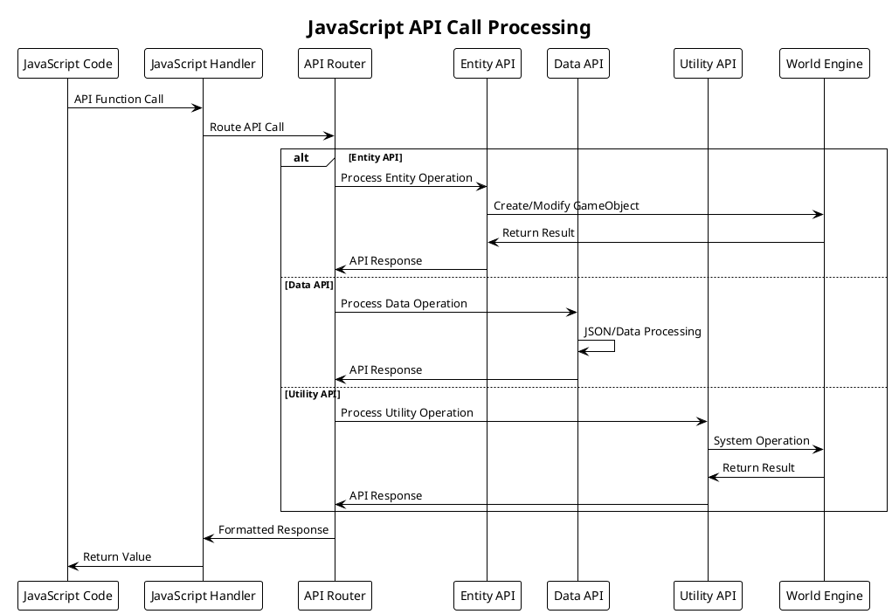

### API Data Serialization

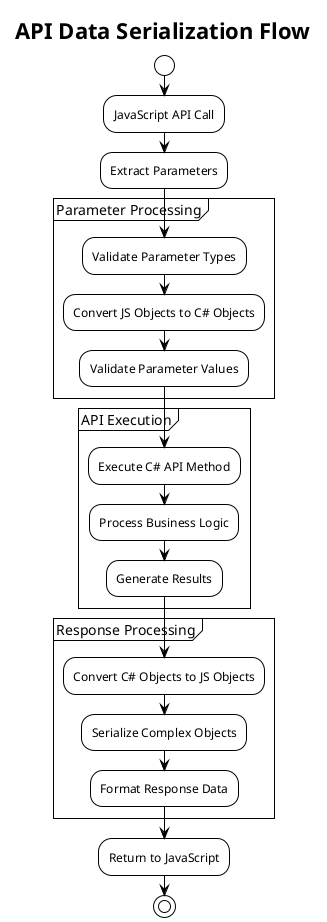

## Synchronization Data Flow

### VOS Synchronization

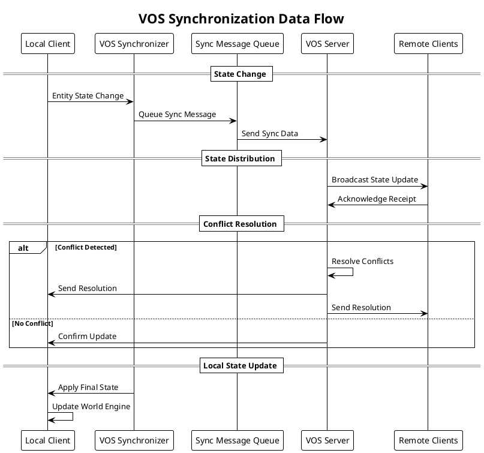

### Synchronization Message Format

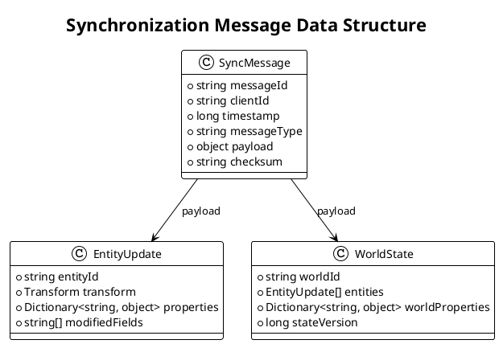

## Network Data Flow

### HTTP Request Processing

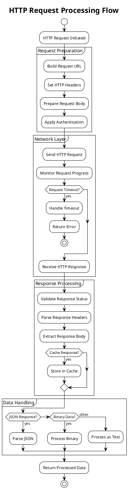

### WebSocket Communication

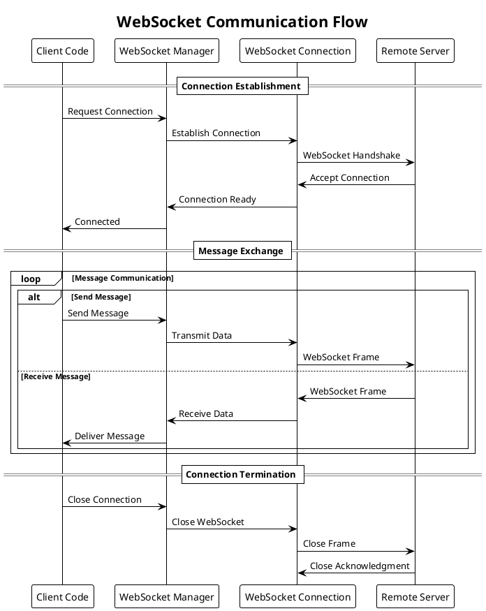

## Local Storage Data Flow

### Storage Operations

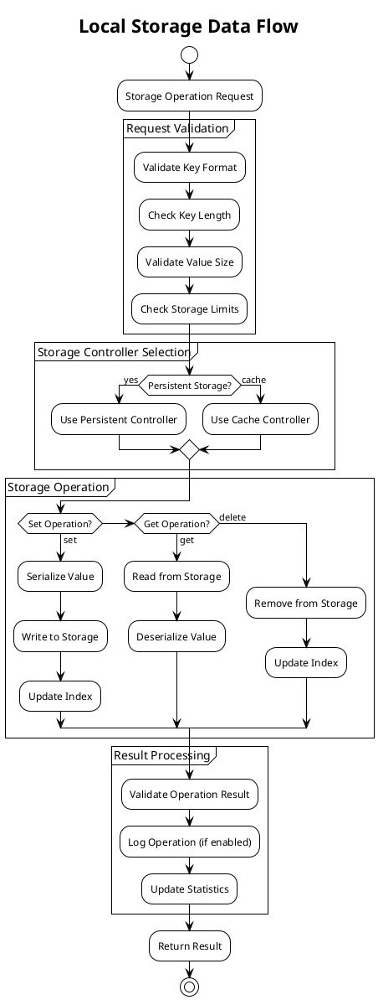

### Cache Management

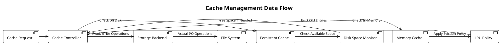

## File System Data Flow

### File Operations

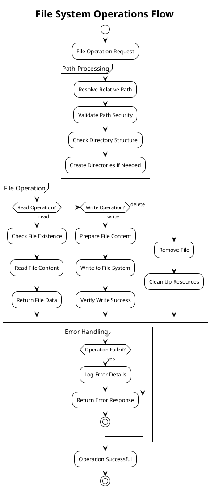

## Performance Optimization Data Flows

### Async Processing Pipeline

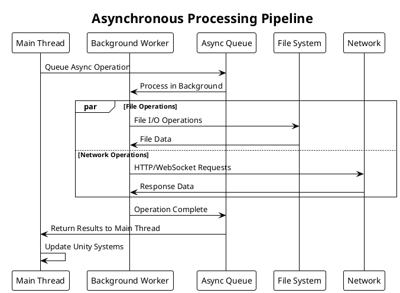

### Memory Management Flow

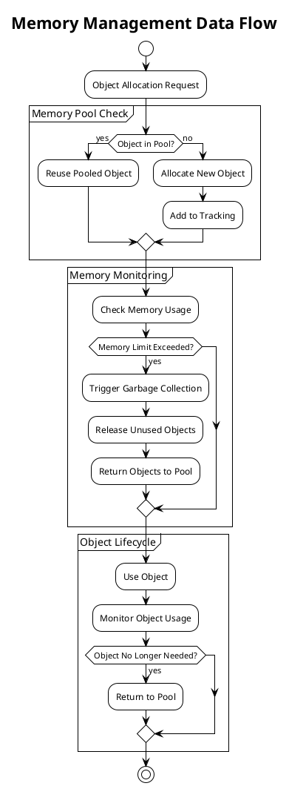

## Data Validation and Security

### Input Validation Flow

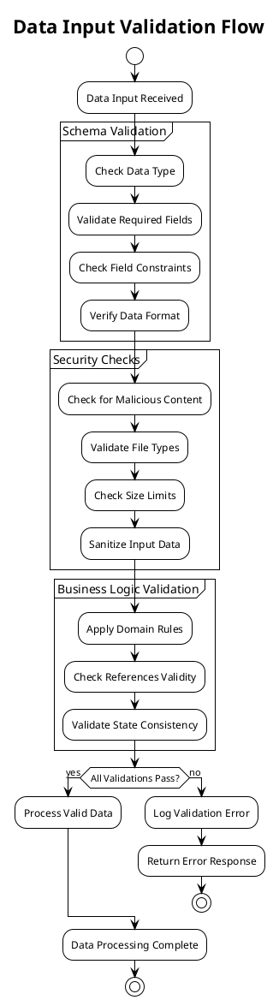

## Error Handling and Recovery

### Error Propagation Flow

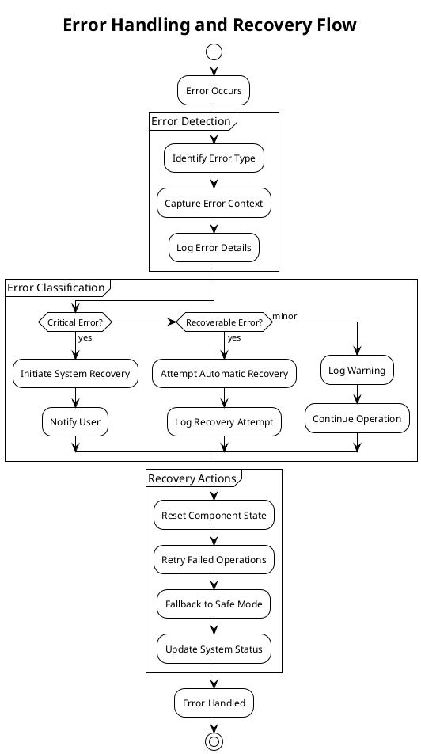

This data flow architecture ensures efficient, secure, and reliable data processing throughout the WebVerse-Runtime system while maintaining performance and user experience standards.