# Handler System Architecture

This document provides an in-depth look at the WebVerse-Runtime handler system, including the base handler architecture, individual handler implementations, lifecycle management, and extension patterns.

## Handler System Overview

The handler system is the core architectural pattern of WebVerse-Runtime, providing a modular and extensible way to process different types of content and functionality.

### Design Principles

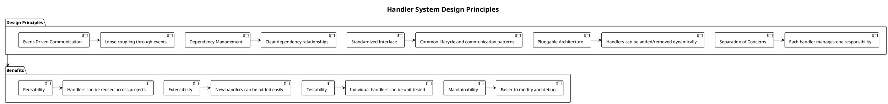

## BaseHandler Architecture

### Base Handler Interface

**Location**: `Assets/Runtime/Utilities/Scripts/BaseHandler.cs`

```csharp
public abstract class BaseHandler : MonoBehaviour
{
    protected bool isInitialized = false;
    
    /// <summary>
    /// Initialize the handler
    /// </summary>
    public virtual void Initialize()
    {
        isInitialized = true;
        LoggingUtility.Log($"[{GetType().Name}] Initialized");
    }
    
    /// <summary>
    /// Terminate the handler and clean up resources
    /// </summary>
    public virtual void Terminate()
    {
        isInitialized = false;
        LoggingUtility.Log($"[{GetType().Name}] Terminated");
    }
    
    /// <summary>
    /// Check if handler is properly initialized
    /// </summary>
    public bool IsInitialized => isInitialized;
}
```

### Handler Lifecycle

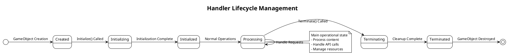

### Handler Registration and Discovery

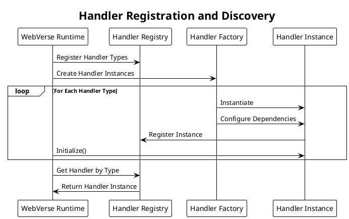

## Core Handler Implementations

### FileHandler

**Purpose**: Manages file system operations and local caching
**Location**: `Assets/Runtime/Handlers/FileHandler/Scripts/FileHandler.cs`

#### Responsibilities
- Local file storage management
- Directory structure creation
- File existence checking and validation
- Image and binary file operations
- Cache management

#### FileHandler Architecture
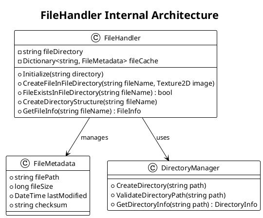

#### File Operation Flow
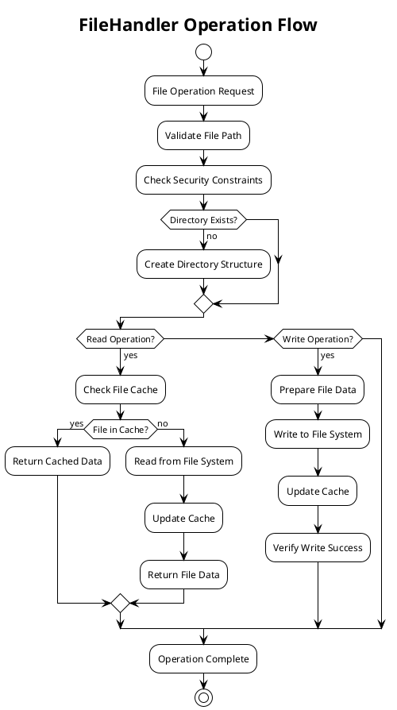

### VEMLHandler

**Purpose**: Processes Virtual Environment Markup Language documents
**Location**: `Assets/Runtime/Handlers/VEMLHandler/`

#### VEML Schema Evolution
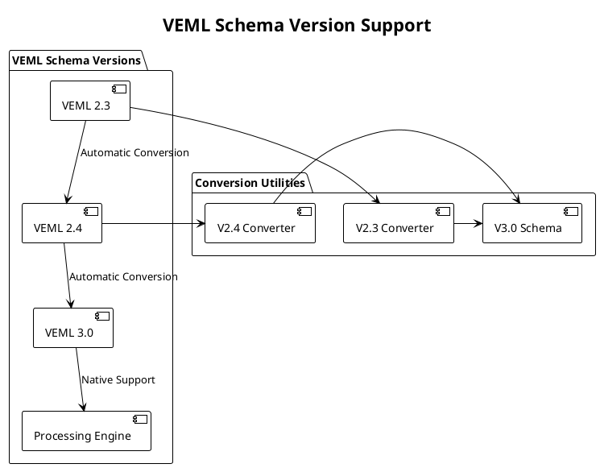

#### VEML Processing Pipeline
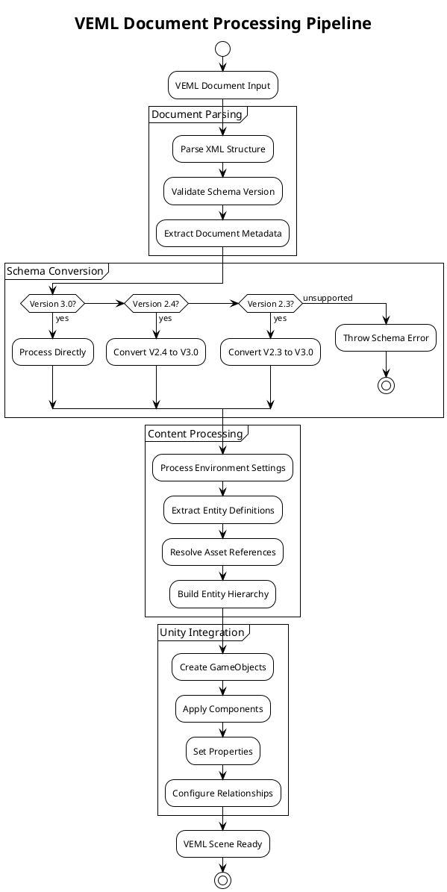

#### VEML Entity System
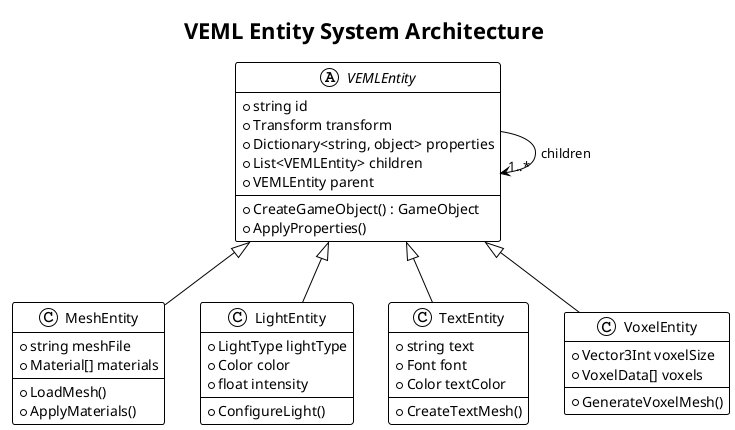

### JavaScriptHandler

**Purpose**: Executes JavaScript code and provides API integration
**Location**: `Assets/Runtime/Handlers/JavascriptHandler/Scripts/JavascriptHandler.cs`

#### JavaScript Execution Architecture
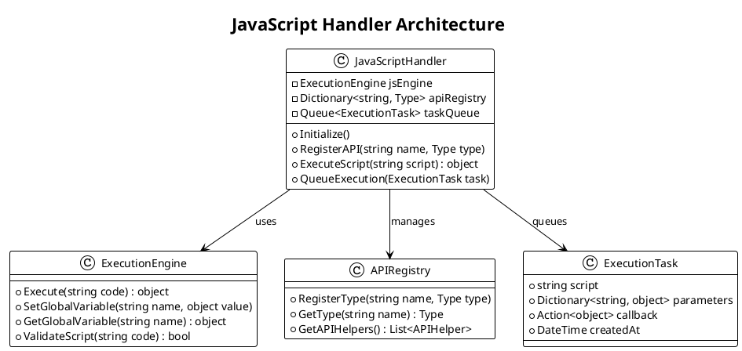

#### JavaScript API System
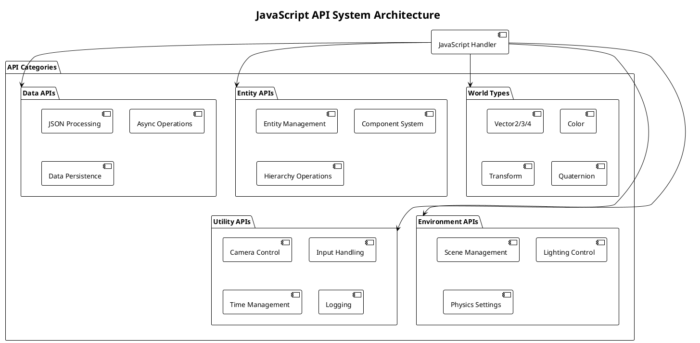

#### JavaScript API Call Flow
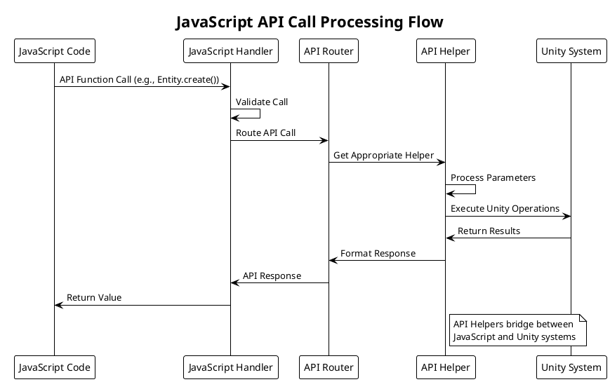

### GLTFHandler

**Purpose**: Loads and processes GLTF 3D models
**Location**: `Assets/Runtime/Handlers/GLTFHandler/`

#### GLTF Import Pipeline
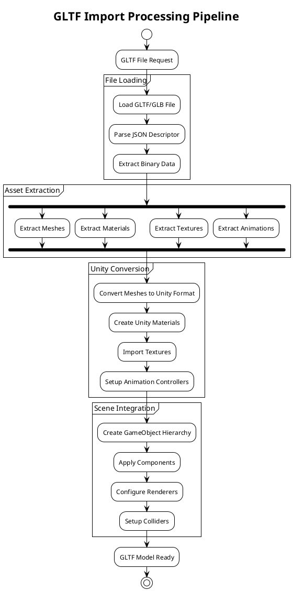

#### GLTF Data Structure
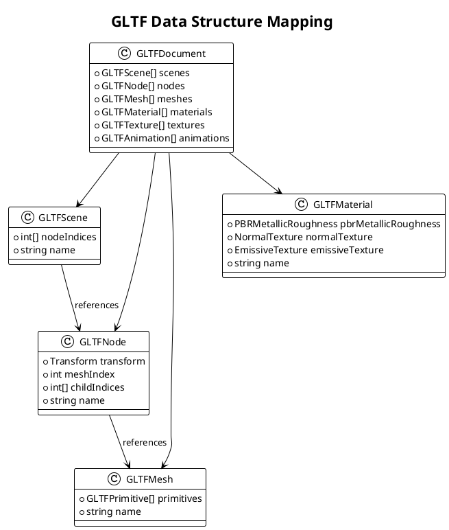

### ImageHandler

**Purpose**: Manages image loading and texture creation
**Location**: `Assets/Runtime/Handlers/ImageHandler/`

#### Image Processing Flow
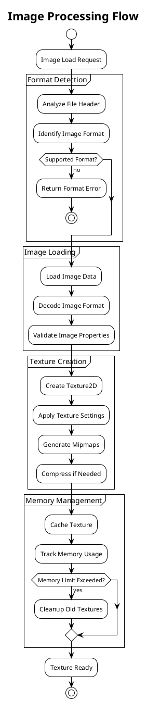

### TimeHandler

**Purpose**: Provides time-related functionality and scheduling
**Location**: `Assets/Runtime/Handlers/TimeHandler/`

#### Time Management System
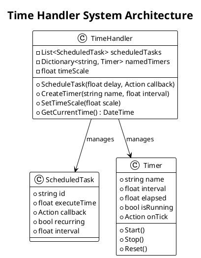

## Handler Communication Patterns

### Inter-Handler Communication

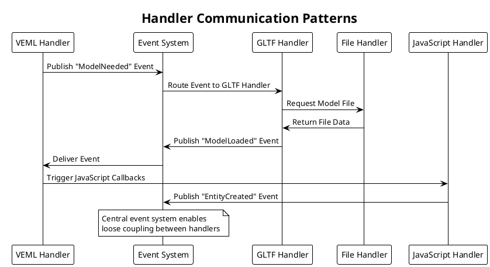

### Handler Dependencies

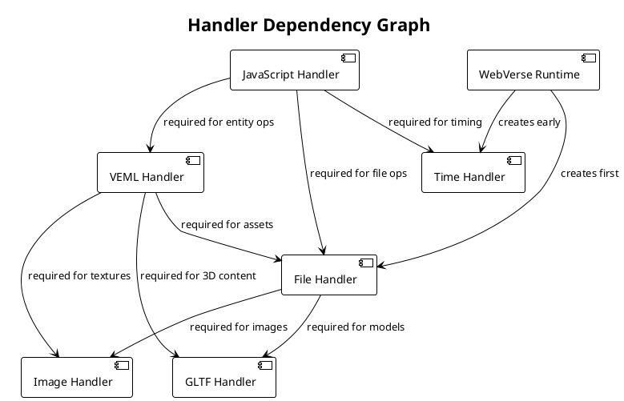

## Handler Extension Patterns

### Creating Custom Handlers

#### Custom Handler Template

```csharp
using FiveSQD.WebVerse.Utilities;
using UnityEngine;

namespace MyProject.Handlers
{
    /// <summary>
    /// Custom handler for specific functionality
    /// </summary>
    public class CustomHandler : BaseHandler
    {
        [Header("Custom Handler Settings")]
        public string customProperty = "default";
        
        private CustomProcessor processor;
        
        public override void Initialize()
        {
            // Validate dependencies
            if (string.IsNullOrEmpty(customProperty))
            {
                Logging.LogError("[CustomHandler] Custom property not set");
                return;
            }
            
            // Initialize components
            processor = new CustomProcessor(customProperty);
            
            // Call base initialization
            base.Initialize();
            
            Logging.Log("[CustomHandler] Initialized successfully");
        }
        
        public override void Terminate()
        {
            // Cleanup resources
            processor?.Dispose();
            processor = null;
            
            // Call base termination
            base.Terminate();
        }
        
        // Custom functionality
        public void ProcessCustomData(CustomData data)
        {
            if (!IsInitialized)
            {
                Logging.LogError("[CustomHandler] Handler not initialized");
                return;
            }
            
            processor.Process(data);
        }
    }
}
```

#### Handler Registration Pattern

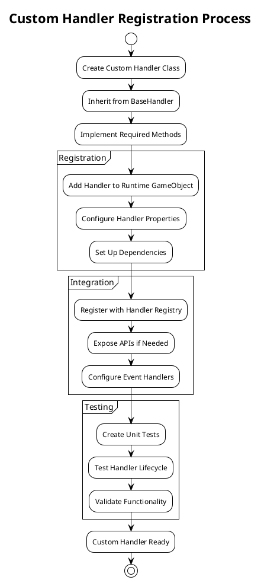

### Handler Plugin Architecture

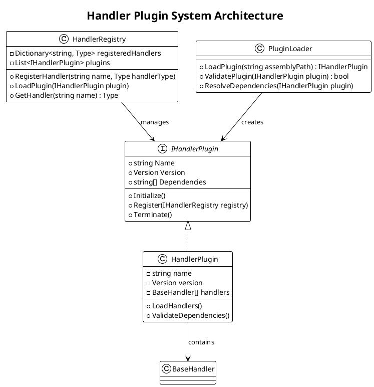

## Performance Optimization

### Handler Performance Patterns

#### Asynchronous Processing
```csharp
public class AsyncHandler : BaseHandler
{
    private readonly Queue<ProcessingTask> taskQueue = new Queue<ProcessingTask>();
    
    public async Task<T> ProcessAsync<T>(Func<T> operation)
    {
        return await Task.Run(() =>
        {
            try
            {
                return operation();
            }
            catch (Exception ex)
            {
                Logging.LogError($"[AsyncHandler] Operation failed: {ex.Message}");
                throw;
            }
        });
    }
}
```

#### Object Pooling for Handlers
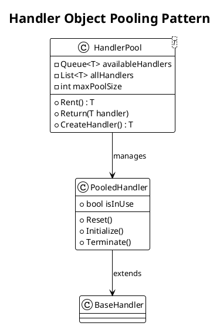

### Memory Management

#### Handler Resource Management
```plantuml
@startuml Handler-Resource-Management
!theme plain

title Handler Resource Management

start
:Handler Created;
:Allocate Resources;
:Register Resource Cleanup;

partition "Resource Tracking" {
  :Track Memory Usage;
  :Monitor File Handles;
  :Track Network Connections;
}

partition "Cleanup Triggers" {
  if (Memory Pressure?) then (yes)
    :Release Cached Resources;
  endif
  
  if (Handler Terminating?) then (yes)
    :Release All Resources;
  endif
  
  if (Idle Timeout?) then (yes)
    :Release Non-Essential Resources;
  endif
}

:Resources Managed;
stop

@enduml
```

## Testing Handlers

### Handler Testing Strategy

```plantuml
@startuml Handler-Testing-Strategy
!theme plain

title Handler Testing Strategy

package "Unit Tests" {
  [Handler Initialization Tests]
  [Handler Method Tests]  
  [Handler Termination Tests]
  [Error Handling Tests]
}

package "Integration Tests" {
  [Handler Communication Tests]
  [Dependency Tests]
  [Event System Tests]
  [API Integration Tests]
}

package "Performance Tests" {
  [Memory Usage Tests]
  [Processing Speed Tests]
  [Resource Cleanup Tests]
  [Concurrent Access Tests]
}

[Handler Implementation] --> [Unit Tests]
[Handler System] --> [Integration Tests]  
[Production Use] --> [Performance Tests]

@enduml
```

### Test Example

```csharp
[Test]
public void FileHandler_Initialize_CreatesDirectory()
{
    // Arrange
    var testDirectory = Path.Combine(Application.temporaryCache, "test");
    var fileHandler = new FileHandler();
    
    // Act
    fileHandler.Initialize(testDirectory);
    
    // Assert
    Assert.IsTrue(Directory.Exists(testDirectory));
    Assert.IsTrue(fileHandler.IsInitialized);
    
    // Cleanup
    fileHandler.Terminate();
    Directory.Delete(testDirectory, true);
}
```

This handler system provides a robust, extensible foundation for processing diverse content types while maintaining clean separation of concerns and enabling easy testing and maintenance.