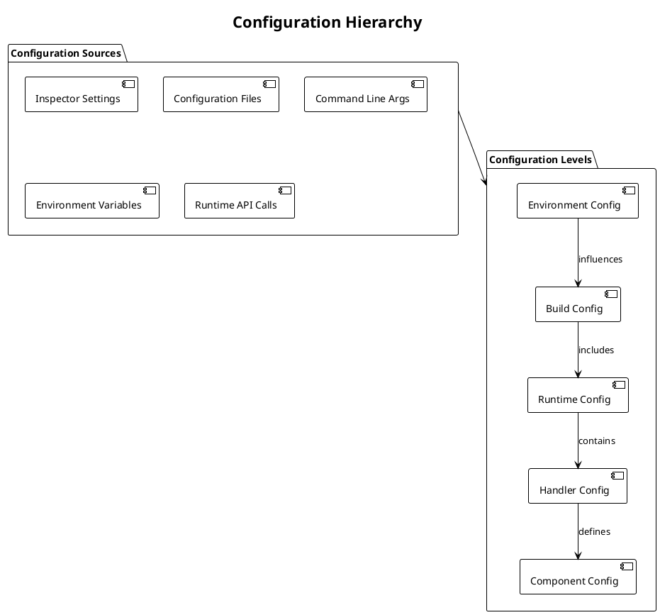
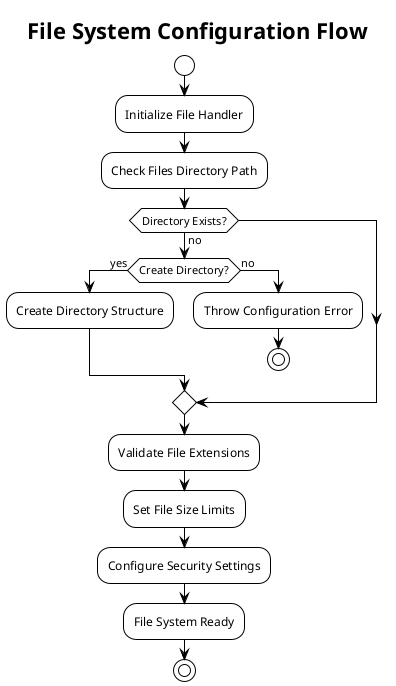
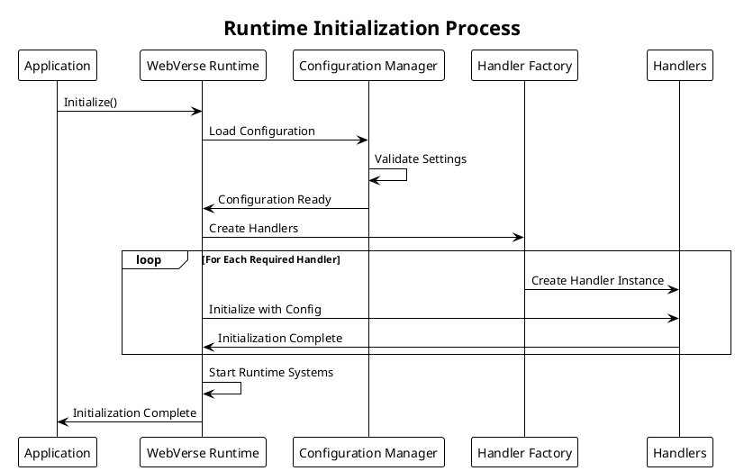
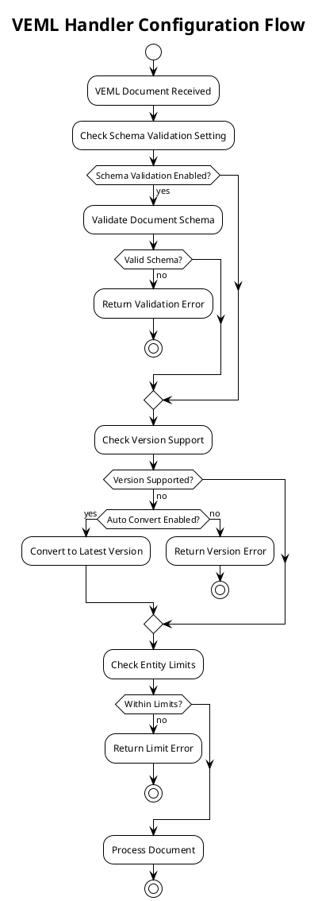
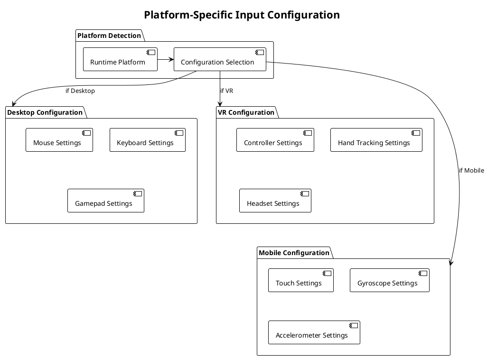
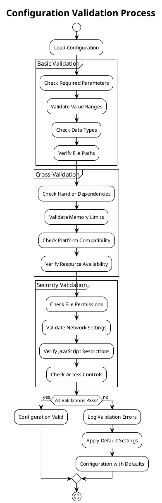

# Runtime Configuration

This document describes how to configure the WebVerse-Runtime system, including initialization parameters, handler settings, and performance tuning options.

## Overview

WebVerse-Runtime configuration is handled through multiple levels:

1. **Runtime Configuration**: Core system settings
2. **Handler Configuration**: Individual handler settings
3. **Build Configuration**: Compilation and deployment settings
4. **Environment Configuration**: Platform-specific settings



## Runtime Configuration

### WebVerseRuntime Configuration

The main runtime configuration is handled through the `WebVerseRuntime` component parameters:

```csharp
[Header("Core Settings")]
public LocalStorageManager.LocalStorageMode storageMode = LocalStorageManager.LocalStorageMode.Persistent;
public int maxStorageEntries = 1000;
public int maxEntryLength = 10000;
public int maxKeyLength = 200;
public string filesDirectory = "WebVerseFiles";
public float initializationTimeout = 120f;

[Header("Input/Output")]
public BasePlatformInput platformInput;
public Transform vrRig;
public Transform desktopRig;

[Header("Console Integration")]
public Interface.Console.Console[] consoles;

[Header("Networking")]
public string defaultServerUrl = "http://localhost:8080";
public int connectionTimeout = 30;
public int maxConcurrentRequests = 10;
```

### Configuration Properties

#### Storage Configuration
```csharp
// Storage mode options
public enum LocalStorageMode
{
    Persistent,     // Data persists between sessions
    Cache,          // Data cleared when application closes
    Memory          // Data only in memory (fastest)
}

// Storage limits
public int maxStorageEntries;    // Maximum number of stored items
public int maxEntryLength;       // Maximum size per entry (bytes)
public int maxKeyLength;         // Maximum key name length
```

**Configuration Example:**
```csharp
// High-capacity persistent storage
storageMode = LocalStorageManager.LocalStorageMode.Persistent;
maxStorageEntries = 10000;
maxEntryLength = 50000;        // 50KB per entry
maxKeyLength = 500;

// Performance-oriented cache storage  
storageMode = LocalStorageManager.LocalStorageMode.Cache;
maxStorageEntries = 5000;
maxEntryLength = 10000;        // 10KB per entry
maxKeyLength = 100;
```

#### File System Configuration
```csharp
// File directory settings
public string filesDirectory = "WebVerseFiles";
public bool createDirectoryIfMissing = true;
public bool validateFilePaths = true;
public string[] allowedFileExtensions = { ".png", ".jpg", ".gltf", ".veml" };
public long maxFileSize = 10485760;  // 10MB default
```

**File System Configuration Flow:**


### Initialization Configuration

```csharp
[Header("Initialization")]
public float initializationTimeout = 120f;
public bool initializeAsynchronously = true;
public string[] requiredHandlers = { "FileHandler", "VEMLHandler", "JavaScriptHandler" };
public bool failOnMissingHandlers = true;
```

#### Initialization Process


## Handler Configuration

### FileHandler Configuration

```csharp
[Header("File Handler Settings")]
public string fileDirectory = "Files";
public bool enableCaching = true;
public int maxCacheSize = 100;  // Max cached files
public bool compressImages = true;
public int imageCompressionQuality = 85;
public string[] supportedFormats = { ".png", ".jpg", ".jpeg", ".gif", ".bmp" };
```

**FileHandler Configuration Example:**
```csharp
// High-performance configuration
var fileConfig = new FileHandlerConfig
{
    fileDirectory = "HighPerformanceCache",
    enableCaching = true,
    maxCacheSize = 500,
    compressImages = false,  // No compression for speed
    supportedFormats = new[] { ".png", ".jpg", ".gltf", ".veml" }
};

// Memory-efficient configuration
var fileConfig = new FileHandlerConfig
{
    fileDirectory = "CompactCache", 
    enableCaching = true,
    maxCacheSize = 50,
    compressImages = true,
    imageCompressionQuality = 60,  // Higher compression
    supportedFormats = new[] { ".png", ".jpg" }  // Limited formats
};
```

### VEMLHandler Configuration

```csharp
[Header("VEML Handler Settings")]
public bool enableSchemaValidation = true;
public bool autoConvertLegacyVersions = true;
public string[] supportedVersions = { "2.3", "2.4", "3.0" };
public int maxEntityDepth = 20;
public int maxEntitiesPerDocument = 10000;
public bool enableAsyncLoading = true;
```

#### VEML Processing Configuration


### JavaScriptHandler Configuration

```csharp
[Header("JavaScript Handler Settings")]
public bool enableJavaScript = true;
public int maxExecutionTimeMs = 100;  // Per script execution
public int maxMemoryUsageMB = 64;
public string[] allowedNamespaces = { "System", "UnityEngine", "WebVerse" };
public string[] blockedFunctions = { "File.Delete", "Directory.Delete" };
public bool enableConsoleLogging = true;
```

**JavaScript Security Configuration:**
```csharp
// Secure configuration
var jsConfig = new JavaScriptConfig
{
    maxExecutionTimeMs = 50,        // Short execution time
    maxMemoryUsageMB = 32,          // Limited memory
    allowedNamespaces = new[] { "WebVerse.API" },  // Restricted namespaces
    blockedFunctions = new[] { 
        "File.Delete", "Directory.Delete", "Process.Start", "System.IO"
    },
    enableConsoleLogging = false    // No console access
};

// Development configuration
var jsConfig = new JavaScriptConfig
{
    maxExecutionTimeMs = 1000,      // Longer execution time
    maxMemoryUsageMB = 128,         // More memory
    allowedNamespaces = new[] {     // More permissive
        "System", "UnityEngine", "WebVerse"
    },
    blockedFunctions = new[] {      // Minimal restrictions
        "File.Delete", "Directory.Delete"
    },
    enableConsoleLogging = true     // Console access enabled
};
```

### GLTFHandler Configuration

```csharp
[Header("GLTF Handler Settings")]
public bool enableTextureCompression = true;
public int maxTextureSize = 2048;
public bool generateMipmaps = true;
public bool importAnimations = true;
public bool importMaterials = true;
public string materialImportMode = "Standard"; // "Standard", "URP", "HDRP"
public int maxVerticesPerMesh = 65535;
```

### InputManager Configuration

```csharp
[Header("Input Manager Settings")]
public bool enableDesktopInput = true;
public bool enableVRInput = false;
public bool enableTouchInput = false;
public float mouseSensitivity = 2.0f;
public bool invertMouseY = false;
public float deadZone = 0.1f;         // Controller dead zone
public int maxSimultaneousInputs = 10;
```

**Platform-Specific Input Configuration:**


## Performance Configuration

### Memory Management Settings

```csharp
[Header("Memory Management")]
public int targetFrameRate = 60;
public bool enableGarbageCollection = true;
public int gcCollectionThreshold = 50;    // MB before GC
public bool useObjectPooling = true;
public int maxPooledObjects = 1000;
public bool enableMemoryProfiling = false;
```

### Rendering Configuration

```csharp
[Header("Rendering Settings")]
public int maxLODLevels = 3;
public float[] lodDistances = { 10f, 50f, 200f };
public bool enableFrustumCulling = true;
public bool enableOcclusionCulling = true;
public int maxShadowDistance = 100;
public bool enableDynamicBatching = true;
public int maxBatchSize = 300;
```

**Performance Configuration Examples:**

```csharp
// High-performance configuration
var perfConfig = new PerformanceConfig
{
    targetFrameRate = 90,
    maxLODLevels = 4,
    lodDistances = new[] { 15f, 75f, 300f, 1000f },
    enableFrustumCulling = true,
    enableOcclusionCulling = true,
    maxShadowDistance = 150,
    enableDynamicBatching = true,
    maxBatchSize = 500
};

// Mobile-optimized configuration
var mobileConfig = new PerformanceConfig
{
    targetFrameRate = 30,
    maxLODLevels = 2,
    lodDistances = new[] { 8f, 25f },
    enableFrustumCulling = true,
    enableOcclusionCulling = false,  // Disabled for performance
    maxShadowDistance = 20,
    enableDynamicBatching = true,
    maxBatchSize = 150
};
```

## Configuration Validation

### Validation Rules



### Validation Implementation

```csharp
public class ConfigurationValidator
{
    public ValidationResult ValidateConfiguration(RuntimeConfig config)
    {
        var result = new ValidationResult();
        
        // Validate storage settings
        if (config.maxStorageEntries <= 0)
        {
            result.AddError("maxStorageEntries must be greater than 0");
        }
        
        if (config.maxEntryLength <= 0)
        {
            result.AddError("maxEntryLength must be greater than 0");
        }
        
        // Validate file settings
        if (string.IsNullOrEmpty(config.filesDirectory))
        {
            result.AddWarning("filesDirectory not set, using default");
            config.filesDirectory = "WebVerseFiles";
        }
        
        // Validate performance settings
        if (config.targetFrameRate < 10 || config.targetFrameRate > 120)
        {
            result.AddWarning("targetFrameRate outside recommended range (10-120)");
        }
        
        // Validate handler dependencies
        foreach (var handler in config.requiredHandlers)
        {
            if (!IsHandlerAvailable(handler))
            {
                result.AddError($"Required handler not available: {handler}");
            }
        }
        
        return result;
    }
}
```

## Configuration Files

### JSON Configuration Format

```json
{
  "runtime": {
    "storageMode": "Persistent",
    "maxStorageEntries": 5000,
    "maxEntryLength": 20000,
    "filesDirectory": "WebVerseFiles",
    "initializationTimeout": 120
  },
  "handlers": {
    "fileHandler": {
      "enableCaching": true,
      "maxCacheSize": 200,
      "compressImages": true,
      "imageCompressionQuality": 85
    },
    "vemlHandler": {
      "enableSchemaValidation": true,
      "autoConvertLegacyVersions": true,
      "maxEntityDepth": 15
    },
    "javascriptHandler": {
      "enableJavaScript": true,
      "maxExecutionTimeMs": 100,
      "maxMemoryUsageMB": 64
    }
  },
  "performance": {
    "targetFrameRate": 60,
    "enableGarbageCollection": true,
    "useObjectPooling": true,
    "maxLODLevels": 3
  },
  "networking": {
    "defaultServerUrl": "http://localhost:8080",
    "connectionTimeout": 30,
    "maxConcurrentRequests": 10
  }
}
```

### Loading Configuration from File

```csharp
public class ConfigurationManager
{
    public RuntimeConfig LoadConfiguration(string configPath)
    {
        try
        {
            var jsonText = File.ReadAllText(configPath);
            var config = JsonUtility.FromJson<RuntimeConfig>(jsonText);
            
            // Apply validation
            var validation = new ConfigurationValidator();
            var result = validation.ValidateConfiguration(config);
            
            if (result.HasErrors && config.failOnValidationErrors)
            {
                throw new ConfigurationException("Configuration validation failed");
            }
            
            LogValidationResults(result);
            return config;
        }
        catch (Exception ex)
        {
            Logging.LogError($"Failed to load configuration: {ex.Message}");
            return GetDefaultConfiguration();
        }
    }
}
```

## Environment-Specific Configuration

### Platform Configuration

```csharp
// Platform-specific configurations
#if UNITY_STANDALONE_WIN
    public const string DEFAULT_FILES_DIR = "C:/WebVerse/Files";
    public const int DEFAULT_MEMORY_LIMIT = 2048;  // 2GB
#elif UNITY_STANDALONE_OSX
    public const string DEFAULT_FILES_DIR = "~/WebVerse/Files";
    public const int DEFAULT_MEMORY_LIMIT = 2048;  // 2GB
#elif UNITY_WEBGL
    public const string DEFAULT_FILES_DIR = "/WebVerse/Files";
    public const int DEFAULT_MEMORY_LIMIT = 512;   // 512MB
#elif UNITY_ANDROID || UNITY_IOS
    public const string DEFAULT_FILES_DIR = "WebVerse/Files";
    public const int DEFAULT_MEMORY_LIMIT = 256;   // 256MB
#endif
```

### Configuration Profiles

```csharp
public enum ConfigurationProfile
{
    Development,    // Full features, verbose logging
    Production,     // Optimized settings, minimal logging
    Testing,        // Test-friendly settings
    Mobile,         // Mobile-optimized settings
    VR,            // VR-optimized settings
    Debug          // Debug-friendly settings
}

public RuntimeConfig GetConfigurationForProfile(ConfigurationProfile profile)
{
    switch (profile)
    {
        case ConfigurationProfile.Development:
            return new RuntimeConfig
            {
                enableJavaScript = true,
                maxExecutionTimeMs = 1000,
                enableConsoleLogging = true,
                enableMemoryProfiling = true,
                targetFrameRate = 60
            };
            
        case ConfigurationProfile.Production:
            return new RuntimeConfig
            {
                enableJavaScript = true,
                maxExecutionTimeMs = 100,
                enableConsoleLogging = false,
                enableMemoryProfiling = false,
                targetFrameRate = 60
            };
            
        case ConfigurationProfile.Mobile:
            return new RuntimeConfig
            {
                enableJavaScript = true,
                maxExecutionTimeMs = 50,
                maxMemoryUsageMB = 128,
                targetFrameRate = 30,
                maxLODLevels = 2
            };
            
        // ... other profiles
        
        default:
            return GetDefaultConfiguration();
    }
}
```

This configuration system provides flexible, validated, and platform-aware settings management for all aspects of the WebVerse-Runtime system.