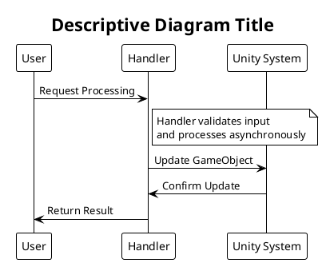

# Contributing Guidelines

Welcome to WebVerse-Runtime! This document provides guidelines for contributing to the project, including development setup, coding standards, and submission processes.

## Getting Started

### Development Environment Setup

1. **Unity Version**: Unity 2021.3.26 or later with Universal Render Pipeline
2. **IDE**: Visual Studio, Visual Studio Code, or JetBrains Rider
3. **Git**: Latest version with LFS support
4. **Node.js**: For documentation tools (optional)

### Repository Setup

```bash
# Clone the repository
git clone https://github.com/Five-Squared-Interactive/WebVerse-Runtime.git
cd WebVerse-Runtime

# Set up Git LFS for large files
git lfs install
git lfs pull

# Create your development branch
git checkout -b feature/your-feature-name
```

### Asset Store Dependencies

Before you can build the project, you'll need these paid Unity Asset Store packages:

- [Best HTTP v3.0.4](https://assetstore.unity.com/packages/tools/network/best-http-267636)
- [Best MQTT v3.0.2](https://assetstore.unity.com/packages/tools/network/best-mqtt-268762)
- [Best WebSockets v3.0.1](https://assetstore.unity.com/packages/tools/network/best-websockets-268757)

## Contribution Types

### Bug Reports

Use the GitHub issue template for bug reports:

```markdown
**Bug Description**
A clear description of the bug.

**Steps to Reproduce**
1. Go to '...'
2. Click on '....'
3. See error

**Expected Behavior**
What you expected to happen.

**Screenshots**
If applicable, add screenshots.

**Environment**
- Unity Version: [e.g. 2021.3.26]
- Platform: [e.g. Windows 10, macOS, WebGL]
- WebVerse Version: [e.g. 1.0.0]

**Additional Context**
Any other context about the problem.
```

### Feature Requests

```markdown
**Feature Summary**
Brief description of the feature.

**Problem Statement**
What problem does this solve?

**Proposed Solution**
Describe your proposed implementation.

**Alternatives Considered**
Other approaches you've considered.

**Additional Context**
Mockups, examples, or related issues.
```

### Code Contributions

We welcome code contributions! Please follow these guidelines:

## Development Workflow

### Branch Naming Convention

```bash
# Feature branches
feature/add-audio-handler
feature/improve-veml-validation

# Bug fix branches  
bugfix/fix-file-handler-memory-leak
bugfix/resolve-javascript-timeout

# Documentation branches
docs/update-api-reference
docs/add-getting-started-guide

# Refactoring branches
refactor/simplify-handler-architecture
refactor/optimize-memory-usage
```

### Commit Message Format

Follow the [Conventional Commits](https://www.conventionalcommits.org/) specification:

```
<type>[optional scope]: <description>

[optional body]

[optional footer(s)]
```

**Types:**
- `feat`: A new feature
- `fix`: A bug fix
- `docs`: Documentation changes
- `style`: Code style changes (formatting, etc.)
- `refactor`: Code refactoring
- `test`: Adding or updating tests
- `chore`: Maintenance tasks

**Examples:**
```bash
feat(handlers): add audio handler for spatial sound

Add AudioHandler component that supports 3D positional audio
with configurable falloff and occlusion.

Closes #123

fix(veml): resolve entity hierarchy parsing bug

The VEML parser was incorrectly handling nested entities with
transform hierarchies. This fix ensures proper parent-child
relationships are maintained.

Fixes #456

docs: update API reference for JavaScript handlers

Add comprehensive examples and parameter descriptions for all
handler JavaScript APIs.
```

### Pull Request Process

1. **Create Feature Branch**
   ```bash
   git checkout -b feature/your-feature-name
   ```

2. **Develop and Test**
   - Write code following our coding standards
   - Add/update unit tests
   - Update documentation if needed
   - Test thoroughly

3. **Commit Changes**
   ```bash
   git add .
   git commit -m "feat(component): add new functionality"
   ```

4. **Push and Create PR**
   ```bash
   git push origin feature/your-feature-name
   ```
   
5. **Create Pull Request** on GitHub with:
   - Clear title and description
   - Reference related issues
   - Include screenshots/videos if UI changes
   - Checklist completion

### Pull Request Template

```markdown
## Description
Brief description of changes made.

## Related Issues
Closes #123
References #456

## Type of Change
- [ ] Bug fix (non-breaking change which fixes an issue)
- [ ] New feature (non-breaking change which adds functionality)
- [ ] Breaking change (fix or feature that would cause existing functionality to not work as expected)
- [ ] Documentation update

## Testing
- [ ] I have added tests that prove my fix is effective or that my feature works
- [ ] New and existing unit tests pass locally with my changes
- [ ] I have tested the changes in Unity Editor
- [ ] I have tested built applications (where applicable)

## Screenshots/Videos
If applicable, add screenshots or videos demonstrating the changes.

## Checklist
- [ ] My code follows the project's coding standards
- [ ] I have performed a self-review of my code
- [ ] I have commented my code, particularly in hard-to-understand areas
- [ ] I have made corresponding changes to the documentation
- [ ] My changes generate no new warnings
- [ ] I have added tests that prove my fix is effective or that my feature works
- [ ] New and existing unit tests pass locally with my changes
```

## Coding Standards

### C# Style Guide

We follow Microsoft's C# coding conventions with some project-specific additions:

#### Naming Conventions

```csharp
// Classes: PascalCase
public class FileHandler : BaseHandler

// Methods: PascalCase
public void LoadFile(string filePath)

// Properties: PascalCase
public bool IsInitialized { get; private set; }

// Fields: camelCase with access modifier
private string fileName;
protected bool isProcessing;
public string publicField; // Avoid public fields, use properties

// Constants: PascalCase
public const string DefaultDirectory = "WebVerseFiles";

// Parameters: camelCase
public void ProcessData(string inputData, int maxRetries)

// Local variables: camelCase
var processedResult = ProcessData(input, 3);
```

#### Code Organization

```csharp
// File header
// Copyright (c) 2019-2025 Five Squared Interactive. All rights reserved.

using System;
using System.Collections.Generic;
using UnityEngine;
using FiveSQD.WebVerse.Utilities;

namespace FiveSQD.WebVerse.Handlers.Custom
{
    /// <summary>
    /// Handles custom processing functionality for WebVerse-Runtime.
    /// Provides methods for loading, processing, and managing custom data.
    /// </summary>
    public class CustomHandler : BaseHandler
    {
        #region Serialized Fields
        [Header("Configuration")]
        [SerializeField] private string configPath = "config.json";
        [SerializeField] private bool enableDebugLogging = false;
        #endregion

        #region Private Fields
        private Dictionary<string, object> dataCache;
        private CustomProcessor processor;
        #endregion

        #region Public Properties
        /// <summary>
        /// Gets the current configuration path.
        /// </summary>
        public string ConfigPath => configPath;
        #endregion

        #region Unity Lifecycle
        void Start()
        {
            // Unity Start method
        }

        void Update() 
        {
            // Unity Update method
        }
        #endregion

        #region BaseHandler Implementation
        public override void Initialize()
        {
            // Implementation
            base.Initialize();
        }

        public override void Terminate()
        {
            // Cleanup
            base.Terminate();
        }
        #endregion

        #region Public Methods
        /// <summary>
        /// Processes the specified data with optional parameters.
        /// </summary>
        /// <param name="data">Data to process</param>
        /// <param name="options">Processing options</param>
        /// <returns>Processed result</returns>
        public ProcessResult ProcessData(string data, ProcessOptions options = null)
        {
            // Implementation
        }
        #endregion

        #region Private Methods
        private bool ValidateInput(string input)
        {
            // Implementation
        }
        #endregion

        #region Event Handlers
        private void OnDataProcessed(ProcessResult result)
        {
            // Implementation
        }
        #endregion
    }
}
```

#### Documentation Standards

```csharp
/// <summary>
/// Processes VEML documents and creates Unity scene hierarchies.
/// Supports VEML versions 2.3, 2.4, and 3.0 with automatic conversion.
/// </summary>
public class VEMLHandler : BaseHandler
{
    /// <summary>
    /// Loads a VEML document from the specified file path asynchronously.
    /// </summary>
    /// <param name="filePath">Absolute or relative path to the VEML file</param>
    /// <param name="onComplete">Callback executed when loading completes. 
    /// Parameter indicates success (true) or failure (false).</param>
    /// <exception cref="ArgumentException">Thrown when filePath is null or empty</exception>
    /// <exception cref="FileNotFoundException">Thrown when the specified file doesn't exist</exception>
    /// <example>
    /// <code>
    /// vemlHandler.LoadVEMLDocument("scenes/main.veml", (success) =>
    /// {
    ///     if (success)
    ///         Debug.Log("VEML loaded successfully");
    ///     else
    ///         Debug.LogError("Failed to load VEML");
    /// });
    /// </code>
    /// </example>
    public void LoadVEMLDocument(string filePath, Action<bool> onComplete)
    {
        // Implementation
    }
}
```

### JavaScript Code Style

For JavaScript code in VEML scripts and examples:

```javascript
// Use camelCase for variables and functions
var playerPosition = new Vector3(0, 0, 0);
var isGameActive = true;

// Use PascalCase for constructors and types
var entity = new Entity();
var color = new Color(1, 0, 0, 1);

// Use descriptive names
function createPlayerCharacter(name, position) {
    var player = Entity.create(name);
    player.position = position;
    return player;
}

// Add comments for complex logic
function calculateOptimalPath(start, end, obstacles) {
    // Use A* pathfinding algorithm to find the shortest route
    // while avoiding the specified obstacles
    var path = [];
    // ... implementation
    return path;
}

// Handle errors gracefully
function loadPlayerData(playerId) {
    try {
        var data = LocalStorage.getItem("player_" + playerId);
        if (data) {
            return JSON.parse(data);
        }
    } catch (error) {
        Logging.LogError("Failed to load player data: " + error);
    }
    return null;
}
```

### VEML Style Guide

For VEML document examples and templates:

```xml
<?xml version="1.0" encoding="UTF-8"?>
<veml xmlns="http://www.fivesqd.com/schemas/veml/3.0" version="3.0">
    <metadata>
        <title>Scene Title</title>
        <description>Clear description of the scene</description>
        <author>Author Name</author>
    </metadata>
    
    <environment>
        <!-- Use clear, descriptive comments -->
        
        <!-- Background and lighting setup -->
        <background>
            <color>skyblue</color>
        </background>
        
        <!-- Ground plane -->
        <entity id="ground" type="plane">
            <transform>
                <position x="0" y="0" z="0"/>
                <scale x="50" y="1" z="50"/>
            </transform>
            <color>darkgreen</color>
        </entity>
        
        <!-- Interactive objects -->
        <entity id="interactiveCube" type="cube">
            <transform>
                <position x="0" y="1" z="0"/>
            </transform>
            <color>blue</color>
            <script>
                // Add interaction behavior
                Input.onMouseDown = function(button, position) {
                    if (button === 0) { // Left click
                        Logging.Log("Cube clicked!");
                    }
                };
            </script>
        </entity>
    </environment>
</veml>
```

## Testing Requirements

### Test Coverage Standards

- **New Features**: Must include comprehensive unit tests
- **Bug Fixes**: Must include regression tests
- **Handler Components**: Minimum 80% code coverage
- **Critical Paths**: 100% code coverage required

### Test Categories

```csharp
[TestFixture]
public class MyComponentTests
{
    [Test]
    [Category("Unit")]
    public void Component_Method_WithValidInput_ReturnsExpectedResult()
    {
        // Unit test
    }
    
    [UnityTest]
    [Category("Integration")]
    public IEnumerator Component_IntegratesWithSystem_WorksCorrectly()
    {
        // Integration test
    }
    
    [Test, Performance]
    [Category("Performance")]
    public void Component_LargeDataSet_CompletesWithinTimeLimit()
    {
        // Performance test
    }
}
```

### Test Data Management

- Use `TestDataFactory` for creating test data
- Store test assets in `Assets/Tests/TestData/`
- Clean up test data in `[TearDown]` methods
- Use temporary directories for file operations

## Documentation Standards

### API Documentation

All public APIs must include:

```csharp
/// <summary>
/// Brief description of what the method does.
/// </summary>
/// <param name="paramName">Description of parameter</param>
/// <returns>Description of return value</returns>
/// <exception cref="ExceptionType">When this exception is thrown</exception>
/// <example>
/// Example usage:
/// <code>
/// var result = SomeMethod("example");
/// </code>
/// </example>
public ReturnType SomeMethod(string paramName)
```

### Markdown Documentation

- Use consistent heading levels
- Include code examples for all concepts
- Add PlantUML diagrams for architectural concepts
- Keep examples up-to-date with code changes
- Use relative links for internal documentation

### PlantUML Guidelines



## Security Guidelines

### Code Security

- **Input Validation**: Always validate user inputs
- **File Path Security**: Use Path.Combine and validate paths
- **JavaScript Sandboxing**: Limit JavaScript API access
- **Network Security**: Validate all network requests

```csharp
// Example secure file handling
public bool LoadFile(string userPath)
{
    // Validate input
    if (string.IsNullOrEmpty(userPath) || userPath.Contains(".."))
    {
        Logging.LogError("Invalid file path");
        return false;
    }
    
    // Use safe path combination
    var safePath = Path.Combine(baseDirectory, userPath);
    var fullPath = Path.GetFullPath(safePath);
    
    // Ensure path is within allowed directory
    if (!fullPath.StartsWith(Path.GetFullPath(baseDirectory)))
    {
        Logging.LogError("Path outside allowed directory");
        return false;
    }
    
    // Proceed with file operation
    return ProcessFile(fullPath);
}
```

### JavaScript API Security

```csharp
// Limit JavaScript execution time and memory
public object ExecuteScript(string script)
{
    if (script.Length > maxScriptLength)
    {
        throw new SecurityException("Script too long");
    }
    
    // Set execution limits
    var executionContext = new ScriptExecutionContext
    {
        MaxExecutionTime = TimeSpan.FromMilliseconds(100),
        MaxMemoryUsage = 64 * 1024 * 1024 // 64MB
    };
    
    return scriptEngine.Execute(script, executionContext);
}
```

## Performance Guidelines

### Memory Management

- Use object pooling for frequently created objects
- Dispose of resources properly in `Terminate()` methods
- Avoid allocations in Update loops
- Use `StringBuilder` for string concatenation

### Async Patterns

```csharp
// Preferred async pattern
public void ProcessDataAsync(string data, Action<ProcessResult> onComplete)
{
    StartCoroutine(ProcessDataCoroutine(data, onComplete));
}

private IEnumerator ProcessDataCoroutine(string data, Action<ProcessResult> onComplete)
{
    // Background processing
    yield return StartCoroutine(BackgroundProcessing(data));
    
    // Return result on main thread
    onComplete?.Invoke(result);
}
```

### Performance Testing

Always include performance tests for:
- File I/O operations
- Large data processing
- Graphics-intensive operations
- Memory-intensive operations

## Release Process

### Version Numbering

We use [Semantic Versioning](https://semver.org/):

- **MAJOR**: Breaking changes
- **MINOR**: New features (backward compatible)
- **PATCH**: Bug fixes (backward compatible)

### Release Checklist

- [ ] All tests passing
- [ ] Documentation updated
- [ ] Performance benchmarks maintained
- [ ] Security review completed
- [ ] Breaking changes documented
- [ ] Migration guide provided (if needed)

### Changelog Format

```markdown
# Changelog

## [1.2.0] - 2024-01-15

### Added
- New AudioHandler for spatial audio support
- JavaScript API for audio control
- Performance optimizations for large scenes

### Changed
- Improved VEML parsing performance
- Updated file caching mechanism

### Deprecated
- Legacy VEMLHandler methods (will be removed in v2.0)

### Removed
- Deprecated utility functions

### Fixed
- Memory leak in JavaScriptHandler
- File path validation on Windows

### Security
- Enhanced input validation for file operations
```

## Community Guidelines

### Code of Conduct

We follow the [Contributor Covenant Code of Conduct](https://www.contributor-covenant.org/):

- **Be Respectful**: Treat everyone with respect and courtesy
- **Be Inclusive**: Welcome people of all backgrounds and experience levels
- **Be Collaborative**: Work together constructively
- **Be Professional**: Keep discussions focused and productive

### Communication Channels

- **GitHub Issues**: Bug reports and feature requests
- **GitHub Discussions**: General questions and discussions
- **Pull Requests**: Code review and collaboration

### Recognition

Contributors are recognized in:
- Project README
- Release notes
- Contributor list

Thank you for contributing to WebVerse-Runtime! Your contributions help make virtual world creation more accessible and powerful for everyone.