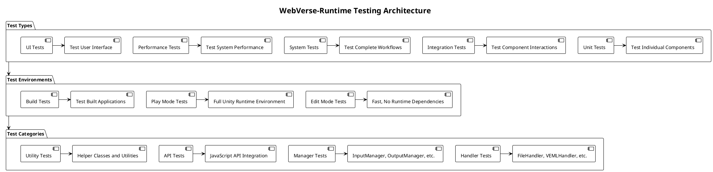

# Testing Guide

This document provides comprehensive guidance on testing WebVerse-Runtime components, including unit tests, integration tests, performance tests, and testing best practices.

## Testing Architecture

WebVerse-Runtime uses Unity's Test Framework for automated testing, with support for both Edit Mode and Play Mode tests.



## Setting Up the Test Environment

### Prerequisites

1. **Unity Test Framework**: Already included in Unity 2021.3+
2. **NUnit**: Comes with Unity Test Framework
3. **Test Assemblies**: Assembly definition files for test organization

### Test Assembly Structure

WebVerse-Runtime test assemblies are organized as follows:

```
Assets/
├── Runtime/
│   ├── Handlers/
│   │   ├── FileHandler/
│   │   │   ├── Tests/
│   │   │   │   ├── FileHandlerTests.cs
│   │   │   │   └── FiveSQD.WebVerse.Handlers.File.Tests.asmdef
│   │   ├── VEMLHandler/
│   │   │   ├── Tests/
│   │   │   │   ├── VEMLHandlerTests.cs
│   │   │   │   └── FiveSQD.WebVerse.Handlers.VEML.Tests.asmdef
```

### Assembly Definition Example

```json
{
    "name": "FiveSQD.WebVerse.Handlers.File.Tests",
    "rootNamespace": "FiveSQD.WebVerse.Handlers.File.Tests",
    "references": [
        "UnityEngine.TestRunner",
        "UnityEditor.TestRunner",
        "FiveSQD.WebVerse",
        "FiveSQD.WebVerse.Handlers.File"
    ],
    "includePlatforms": [],
    "excludePlatforms": [],
    "allowUnsafeCode": false,
    "overrideReferences": true,
    "precompiledReferences": [
        "nunit.framework.dll"
    ],
    "autoReferenced": false,
    "defineConstraints": [
        "UNITY_INCLUDE_TESTS"
    ],
    "optionalUnityReferences": [
        "TestAssemblies"
    ]
}
```

## Unit Testing

### FileHandler Unit Tests

```csharp
using NUnit.Framework;
using UnityEngine;
using UnityEngine.TestTools;
using System.IO;
using System.Collections;
using FiveSQD.WebVerse.Handlers.File;

namespace FiveSQD.WebVerse.Handlers.File.Tests
{
    [TestFixture]
    public class FileHandlerTests
    {
        private FileHandler fileHandler;
        private GameObject testObject;
        private string testDirectory;
        
        [SetUp]
        public void Setup()
        {
            // Create test GameObject
            testObject = new GameObject("TestFileHandler");
            fileHandler = testObject.AddComponent<FileHandler>();
            
            // Create temporary test directory
            testDirectory = Path.Combine(Application.temporaryCachePath, "FileHandlerTests");
            if (Directory.Exists(testDirectory))
            {
                Directory.Delete(testDirectory, true);
            }
        }
        
        [TearDown]
        public void Teardown()
        {
            // Cleanup handler
            if (fileHandler != null && fileHandler.IsInitialized)
            {
                fileHandler.Terminate();
            }
            
            // Cleanup GameObject
            if (testObject != null)
            {
                Object.DestroyImmediate(testObject);
            }
            
            // Cleanup test directory
            if (Directory.Exists(testDirectory))
            {
                try
                {
                    Directory.Delete(testDirectory, true);
                }
                catch (System.Exception ex)
                {
                    Debug.LogWarning($"Failed to cleanup test directory: {ex.Message}");
                }
            }
        }
        
        [Test]
        public void FileHandler_Initialize_WithValidDirectory_SetsInitializedTrue()
        {
            // Act
            fileHandler.Initialize(testDirectory);
            
            // Assert
            Assert.IsTrue(fileHandler.IsInitialized);
            Assert.IsTrue(Directory.Exists(testDirectory));
        }
        
        [Test]
        public void FileHandler_Initialize_WithInvalidDirectory_ThrowsException()
        {
            // Arrange
            string invalidPath = "//invalid/path/with/invalid/characters<>|";
            
            // Act & Assert
            Assert.Throws<System.ArgumentException>(() => 
            {
                fileHandler.Initialize(invalidPath);
            });
        }
        
        [Test]
        public void FileHandler_FileExistsInFileDirectory_WithExistingFile_ReturnsTrue()
        {
            // Arrange
            fileHandler.Initialize(testDirectory);
            string testFileName = "test-file.txt";
            string fullPath = Path.Combine(testDirectory, testFileName);
            File.WriteAllText(fullPath, "test content");
            
            // Act
            bool exists = fileHandler.FileExistsInFileDirectory(testFileName);
            
            // Assert
            Assert.IsTrue(exists);
        }
        
        [Test]
        public void FileHandler_FileExistsInFileDirectory_WithNonExistingFile_ReturnsFalse()
        {
            // Arrange
            fileHandler.Initialize(testDirectory);
            
            // Act
            bool exists = fileHandler.FileExistsInFileDirectory("non-existent.txt");
            
            // Assert
            Assert.IsFalse(exists);
        }
        
        [Test]
        public void FileHandler_CreateFileInFileDirectory_WithValidImage_CreatesFile()
        {
            // Arrange
            fileHandler.Initialize(testDirectory);
            string fileName = "test-image.png";
            
            // Create test texture
            var texture = new Texture2D(16, 16);
            for (int x = 0; x < 16; x++)
            {
                for (int y = 0; y < 16; y++)
                {
                    texture.SetPixel(x, y, Color.red);
                }
            }
            texture.Apply();
            
            // Act
            fileHandler.CreateFileInFileDirectory(fileName, texture);
            
            // Assert
            Assert.IsTrue(fileHandler.FileExistsInFileDirectory(fileName));
            
            // Cleanup
            Object.DestroyImmediate(texture);
        }
        
        [Test]
        public void FileHandler_CreateDirectoryStructure_WithNestedPath_CreatesAllDirectories()
        {
            // Arrange
            fileHandler.Initialize(testDirectory);
            string nestedPath = "level1/level2/level3/file.txt";
            
            // Act
            fileHandler.CreateDirectoryStructure(Path.Combine(testDirectory, nestedPath));
            
            // Assert
            string expectedDir = Path.Combine(testDirectory, "level1/level2/level3");
            Assert.IsTrue(Directory.Exists(expectedDir));
        }
        
        [Test]  
        public void FileHandler_Terminate_CleansUpResources()
        {
            // Arrange
            fileHandler.Initialize(testDirectory);
            Assert.IsTrue(fileHandler.IsInitialized);
            
            // Act
            fileHandler.Terminate();
            
            // Assert
            Assert.IsFalse(fileHandler.IsInitialized);
        }
        
        [Test]
        public void FileHandler_CallMethodsBeforeInitialization_LogsError()
        {
            // Arrange
            LogAssert.Expect(LogType.Error, 
                new System.Text.RegularExpressions.Regex(".*Initialize must be called.*"));
            
            // Act
            fileHandler.FileExistsInFileDirectory("test.txt");
            
            // Assert is handled by LogAssert.Expect
        }
    }
}
```

### VEMLHandler Unit Tests

```csharp
using NUnit.Framework;
using UnityEngine;
using UnityEngine.TestTools;
using System.Collections;
using FiveSQD.WebVerse.Handlers.VEML;

namespace FiveSQD.WebVerse.Handlers.VEML.Tests
{
    [TestFixture]
    public class VEMLHandlerTests
    {
        private VEMLHandler vemlHandler;
        private GameObject testObject;
        
        [SetUp]
        public void Setup()
        {
            testObject = new GameObject("TestVEMLHandler");
            vemlHandler = testObject.AddComponent<VEMLHandler>();
        }
        
        [TearDown]
        public void Teardown()
        {
            if (vemlHandler != null && vemlHandler.IsInitialized)
            {
                vemlHandler.Terminate();
            }
            
            if (testObject != null)
            {
                Object.DestroyImmediate(testObject);
            }
        }
        
        [Test]
        public void VEMLHandler_ValidateVEMLDocument_WithValidV3Document_ReturnsTrue()
        {
            // Arrange
            vemlHandler.Initialize();
            string validVEML = @"<?xml version='1.0' encoding='UTF-8'?>
                <veml xmlns='http://www.fivesqd.com/schemas/veml/3.0' version='3.0'>
                    <metadata>
                        <title>Test Scene</title>
                    </metadata>
                    <environment>
                        <entity id='test' type='cube'>
                            <transform>
                                <position x='0' y='0' z='0'/>
                            </transform>
                        </entity>
                    </environment>
                </veml>";
            
            // Act
            bool isValid = vemlHandler.ValidateVEMLDocument(validVEML);
            
            // Assert
            Assert.IsTrue(isValid);
        }
        
        [Test]
        public void VEMLHandler_ValidateVEMLDocument_WithInvalidXML_ReturnsFalse()
        {
            // Arrange
            vemlHandler.Initialize();
            string invalidVEML = @"<?xml version='1.0'?>
                <veml>
                    <unclosed-tag>
                </veml>";
            
            // Act
            bool isValid = vemlHandler.ValidateVEMLDocument(invalidVEML);
            
            // Assert
            Assert.IsFalse(isValid);
        }
        
        [UnityTest]
        public IEnumerator VEMLHandler_LoadVEMLFromString_WithValidDocument_CallsCallbackWithTrue()
        {
            // Arrange
            vemlHandler.Initialize();
            bool callbackExecuted = false;
            bool callbackResult = false;
            
            string validVEML = CreateTestVEMLDocument();
            
            // Act
            vemlHandler.LoadVEMLFromString(validVEML, (success) =>
            {
                callbackResult = success;
                callbackExecuted = true;
            });
            
            // Wait for async operation
            yield return new WaitUntil(() => callbackExecuted);
            
            // Assert
            Assert.IsTrue(callbackResult);
        }
        
        [Test]
        public void VEMLHandler_ConvertToLatestVersion_WithV24Document_ReturnsV30Document()
        {
            // Arrange
            vemlHandler.Initialize();
            string v24VEML = CreateTestV24VEMLDocument();
            
            // Act
            string convertedVEML = vemlHandler.ConvertToLatestVersion(v24VEML, "2.4");
            
            // Assert
            Assert.IsTrue(convertedVEML.Contains("version=\"3.0\""));
            Assert.IsTrue(convertedVEML.Contains("xmlns=\"http://www.fivesqd.com/schemas/veml/3.0\""));
        }
        
        private string CreateTestVEMLDocument()
        {
            return @"<?xml version='1.0' encoding='UTF-8'?>
                <veml xmlns='http://www.fivesqd.com/schemas/veml/3.0' version='3.0'>
                    <metadata>
                        <title>Test Scene</title>
                        <description>A test scene for unit testing</description>
                    </metadata>
                    <environment>
                        <background>
                            <color>skyblue</color>
                        </background>
                        <entity id='ground' type='plane'>
                            <transform>
                                <position x='0' y='0' z='0'/>
                                <scale x='10' y='1' z='10'/>
                            </transform>
                            <color>green</color>
                        </entity>
                        <entity id='cube' type='cube'>
                            <transform>
                                <position x='0' y='1' z='0'/>
                            </transform>
                            <color>red</color>
                        </entity>
                    </environment>
                </veml>";
        }
        
        private string CreateTestV24VEMLDocument()
        {
            return @"<?xml version='1.0' encoding='UTF-8'?>
                <veml xmlns='http://www.fivesqd.com/schemas/veml/2.4' version='2.4'>
                    <metadata>
                        <title>Test V2.4 Scene</title>
                    </metadata>
                    <environment>
                        <entity id='cube' type='cube'>
                            <position x='0' y='1' z='0'/>
                            <color>red</color>
                        </entity>
                    </environment>
                </veml>";
        }
    }
}
```

### JavaScriptHandler Unit Tests

```csharp
using NUnit.Framework;
using UnityEngine;
using UnityEngine.TestTools;
using System.Collections;
using FiveSQD.WebVerse.Handlers.Javascript;

namespace FiveSQD.WebVerse.Handlers.Javascript.Tests
{
    [TestFixture]
    public class JavaScriptHandlerTests
    {
        private JavaScriptHandler jsHandler;
        private GameObject testObject;
        
        [SetUp]
        public void Setup()
        {
            testObject = new GameObject("TestJavaScriptHandler");
            jsHandler = testObject.AddComponent<JavaScriptHandler>();
        }
        
        [TearDown]
        public void Teardown()
        {
            if (jsHandler != null && jsHandler.IsInitialized)
            {
                jsHandler.Terminate();
            }
            
            if (testObject != null)
            {
                Object.DestroyImmediate(testObject);
            }
        }
        
        [Test]
        public void JavaScriptHandler_ExecuteScript_WithSimpleExpression_ReturnsCorrectResult()
        {
            // Arrange
            jsHandler.Initialize();
            string script = "5 + 3;";
            
            // Act
            object result = jsHandler.ExecuteScript(script);
            
            // Assert
            Assert.AreEqual(8, System.Convert.ToInt32(result));
        }
        
        [Test]
        public void JavaScriptHandler_ExecuteScript_WithStringOperation_ReturnsString()
        {
            // Arrange
            jsHandler.Initialize();
            string script = "'Hello ' + 'World';";
            
            // Act
            object result = jsHandler.ExecuteScript(script);
            
            // Assert
            Assert.AreEqual("Hello World", result.ToString());
        }
        
        [Test]
        public void JavaScriptHandler_ExecuteScript_WithInvalidSyntax_ThrowsException()
        {
            // Arrange
            jsHandler.Initialize();
            string invalidScript = "var x = ;"; // Invalid syntax
            
            // Act & Assert
            Assert.Throws<JavaScriptExecutionException>(() =>
            {
                jsHandler.ExecuteScript(invalidScript);
            });
        }
        
        [UnityTest]
        public IEnumerator JavaScriptHandler_ExecuteScriptAsync_WithValidScript_CallsCallback()
        {
            // Arrange
            jsHandler.Initialize();
            object callbackResult = null;
            bool callbackExecuted = false;
            
            string script = "Math.sqrt(16);";
            
            // Act
            jsHandler.ExecuteScriptAsync(script, (result) =>
            {
                callbackResult = result;
                callbackExecuted = true;
            });
            
            // Wait for async execution
            yield return new WaitUntil(() => callbackExecuted);
            
            // Assert
            Assert.AreEqual(4, System.Convert.ToInt32(callbackResult));
        }
        
        [Test]
        public void JavaScriptHandler_SetGlobalVariable_AndRetrieve_ReturnsCorrectValue()
        {
            // Arrange
            jsHandler.Initialize();
            string varName = "testVar";
            string varValue = "testValue";
            
            // Act
            jsHandler.SetGlobalVariable(varName, varValue);
            object result = jsHandler.GetGlobalVariable(varName);
            
            // Assert
            Assert.AreEqual(varValue, result);
        }
        
        [Test]
        public void JavaScriptHandler_RegisterAPI_MakesAPIAvailableInScript()
        {
            // Arrange
            jsHandler.Initialize();
            jsHandler.RegisterAPI("TestAPI", typeof(TestJavaScriptAPI));
            
            string script = "TestAPI.GetTestValue();";
            
            // Act
            object result = jsHandler.ExecuteScript(script);
            
            // Assert
            Assert.AreEqual("TestValue", result);
        }
    }
    
    // Test API class for JavaScript integration testing
    public static class TestJavaScriptAPI
    {
        public static string GetTestValue()
        {
            return "TestValue";
        }
        
        public static int AddNumbers(int a, int b)
        {
            return a + b;
        }
        
        public static Vector3 CreateVector(float x, float y, float z)
        {
            return new Vector3(x, y, z);
        }
    }
}
```

## Integration Testing

### System Integration Tests

```csharp
using NUnit.Framework;
using UnityEngine;
using UnityEngine.TestTools;
using System.Collections;
using FiveSQD.WebVerse.Runtime;

namespace FiveSQD.WebVerse.Tests.Integration
{
    [TestFixture]
    public class WebVerseRuntimeIntegrationTests
    {
        private GameObject runtimeObject;
        private WebVerseRuntime runtime;
        
        [SetUp]
        public void Setup()
        {
            runtimeObject = new GameObject("TestWebVerseRuntime");
            runtime = runtimeObject.AddComponent<WebVerseRuntime>();
        }
        
        [TearDown]
        public void Teardown()
        {
            if (runtime != null)
            {
                runtime.Terminate();
            }
            
            if (runtimeObject != null)
            {
                Object.DestroyImmediate(runtimeObject);
            }
        }
        
        [UnityTest]
        public IEnumerator WebVerseRuntime_FullInitialization_InitializesAllHandlers()
        {
            // Arrange
            string testFilesDir = System.IO.Path.Combine(Application.temporaryCachePath, "IntegrationTest");
            
            // Act
            runtime.InitializeComponents(
                LocalStorageManager.LocalStorageMode.Cache,
                100, 1000, 50, testFilesDir, 30f);
            
            // Wait for initialization
            yield return new WaitForSeconds(2f);
            
            // Assert
            Assert.IsNotNull(runtime.fileHandler);
            Assert.IsTrue(runtime.fileHandler.IsInitialized);
            
            Assert.IsNotNull(runtime.vemlHandler);
            Assert.IsTrue(runtime.vemlHandler.IsInitialized);
            
            Assert.IsNotNull(runtime.javascriptHandler);
            Assert.IsTrue(runtime.javascriptHandler.IsInitialized);
        }
        
        [UnityTest]
        public IEnumerator VEMLHandler_LoadsContent_JavaScriptCanInteract()
        {
            // Arrange
            yield return InitializeRuntimeAsync();
            
            string testVEML = CreateTestVEMLWithScript();
            
            bool vemlLoaded = false;
            bool scriptExecuted = false;
            
            // Set up script execution callback
            runtime.javascriptHandler.OnScriptExecuted += (result) =>
            {
                if (result != null && result.ToString().Contains("EntityCreated"))
                {
                    scriptExecuted = true;
                }
            };
            
            // Act
            runtime.vemlHandler.LoadVEMLFromString(testVEML, (success) =>
            {
                vemlLoaded = success;
            });
            
            // Wait for operations to complete
            yield return new WaitUntil(() => vemlLoaded && scriptExecuted);
            
            // Assert
            Assert.IsTrue(vemlLoaded);
            Assert.IsTrue(scriptExecuted);
        }
        
        private IEnumerator InitializeRuntimeAsync()
        {
            string testFilesDir = System.IO.Path.Combine(Application.temporaryCachePath, "IntegrationTest");
            runtime.InitializeComponents(
                LocalStorageManager.LocalStorageMode.Cache,
                100, 1000, 50, testFilesDir, 30f);
            
            yield return new WaitForSeconds(1f);
        }
        
        private string CreateTestVEMLWithScript()
        {
            return @"<?xml version='1.0' encoding='UTF-8'?>
                <veml xmlns='http://www.fivesqd.com/schemas/veml/3.0' version='3.0'>
                    <metadata>
                        <title>Integration Test Scene</title>
                    </metadata>
                    <environment>
                        <entity id='testCube' type='cube'>
                            <transform>
                                <position x='0' y='1' z='0'/>
                            </transform>
                            <color>blue</color>
                            <script>
                                Logging.Log('EntityCreated: testCube');
                                Entity.setProperty('testCube', 'tested', true);
                            </script>
                        </entity>
                    </environment>
                </veml>";
        }
    }
}
```

## Performance Testing

### Handler Performance Tests

```csharp
using NUnit.Framework;
using UnityEngine;
using UnityEngine.TestTools;
using System.Collections;
using System.Diagnostics;
using FiveSQD.WebVerse.Handlers.File;

namespace FiveSQD.WebVerse.Tests.Performance
{
    [TestFixture]
    public class FileHandlerPerformanceTests
    {
        private FileHandler fileHandler;
        private GameObject testObject;
        private string testDirectory;
        
        [SetUp]
        public void Setup()
        {
            testObject = new GameObject("PerfTestFileHandler");
            fileHandler = testObject.AddComponent<FileHandler>();
            testDirectory = System.IO.Path.Combine(Application.temporaryCachePath, "PerfTest");
            fileHandler.Initialize(testDirectory);
        }
        
        [TearDown]
        public void Teardown()
        {
            if (fileHandler != null)
            {
                fileHandler.Terminate();
            }
            
            if (testObject != null)
            {
                Object.DestroyImmediate(testObject);
            }
            
            if (System.IO.Directory.Exists(testDirectory))
            {
                System.IO.Directory.Delete(testDirectory, true);
            }
        }
        
        [Test, Performance]
        public void FileHandler_MultipleFileOperations_CompletesWithinTimeLimit()
        {
            // Arrange
            const int fileCount = 100;
            const int maxTimeMs = 5000; // 5 seconds
            
            var stopwatch = Stopwatch.StartNew();
            
            // Act
            for (int i = 0; i < fileCount; i++)
            {
                string fileName = $"test-file-{i}.txt";
                var testTexture = CreateTestTexture(32, 32);
                
                fileHandler.CreateFileInFileDirectory(fileName, testTexture);
                
                Object.DestroyImmediate(testTexture);
            }
            
            stopwatch.Stop();
            
            // Assert
            Assert.Less(stopwatch.ElapsedMilliseconds, maxTimeMs,
                $"File operations took {stopwatch.ElapsedMilliseconds}ms, expected less than {maxTimeMs}ms");
        }
        
        [Test, Performance]
        public void FileHandler_FileExistenceCheck_ScalesLinearly()
        {
            // Arrange
            const int smallCount = 10;
            const int largeCount = 100;
            
            // Create test files
            for (int i = 0; i < largeCount; i++)
            {
                string fileName = $"scale-test-{i}.txt";
                System.IO.File.WriteAllText(
                    System.IO.Path.Combine(testDirectory, fileName), 
                    "test content");
            }
            
            // Measure small batch
            var smallStopwatch = Stopwatch.StartNew();
            for (int i = 0; i < smallCount; i++)
            {
                fileHandler.FileExistsInFileDirectory($"scale-test-{i}.txt");
            }
            smallStopwatch.Stop();
            
            // Measure large batch
            var largeStopwatch = Stopwatch.StartNew();
            for (int i = 0; i < largeCount; i++)
            {
                fileHandler.FileExistsInFileDirectory($"scale-test-{i}.txt");
            }
            largeStopwatch.Stop();
            
            // Calculate scaling factor
            double expectedRatio = (double)largeCount / smallCount;
            double actualRatio = (double)largeStopwatch.ElapsedMilliseconds / smallStopwatch.ElapsedMilliseconds;
            
            // Assert linear scaling (within reasonable tolerance)
            Assert.Less(actualRatio, expectedRatio * 2.0,
                $"File existence checks don't scale linearly. Expected ~{expectedRatio:F2}x, got {actualRatio:F2}x");
        }
        
        private Texture2D CreateTestTexture(int width, int height)
        {
            var texture = new Texture2D(width, height);
            for (int x = 0; x < width; x++)
            {
                for (int y = 0; y < height; y++)
                {
                    texture.SetPixel(x, y, Color.red);
                }
            }
            texture.Apply();
            return texture;
        }
    }
}
```

### Memory Usage Tests

```csharp
using NUnit.Framework;
using UnityEngine;
using Unity.Profiling;
using FiveSQD.WebVerse.Handlers.Javascript;

namespace FiveSQD.WebVerse.Tests.Performance
{
    [TestFixture]
    public class MemoryUsageTests
    {
        private ProfilerRecorder totalMemoryRecorder;
        
        [SetUp]
        public void Setup()
        {
            totalMemoryRecorder = ProfilerRecorder.StartNew(ProfilerCategory.Memory, "Total Used Memory");
        }
        
        [TearDown]
        public void Teardown()
        {
            totalMemoryRecorder.Dispose();
        }
        
        [Test, Performance]
        public void JavaScriptHandler_MultipleExecutions_DoesNotLeakMemory()
        {
            // Arrange
            var jsHandler = CreateJavaScriptHandler();
            long initialMemory = totalMemoryRecorder.LastValue;
            
            // Act - Execute many scripts
            for (int i = 0; i < 1000; i++)
            {
                jsHandler.ExecuteScript($"var temp{i} = {i} * 2;");
            }
            
            // Force garbage collection
            System.GC.Collect();
            System.GC.WaitForPendingFinalizers();
            System.GC.Collect();
            
            // Wait a frame for memory to stabilize
            yield return null;
            
            long finalMemory = totalMemoryRecorder.LastValue;
            long memoryDelta = finalMemory - initialMemory;
            
            // Assert memory usage is reasonable (less than 10MB increase)
            const long maxMemoryIncrease = 10 * 1024 * 1024; // 10MB
            Assert.Less(memoryDelta, maxMemoryIncrease,
                $"Memory increased by {memoryDelta / (1024 * 1024)}MB, expected less than {maxMemoryIncrease / (1024 * 1024)}MB");
            
            // Cleanup
            Object.DestroyImmediate(jsHandler.gameObject);
        }
        
        private JavaScriptHandler CreateJavaScriptHandler()
        {
            var go = new GameObject("TestJSHandler");
            var handler = go.AddComponent<JavaScriptHandler>();
            handler.Initialize();
            return handler;
        }
    }
}
```

## Test Automation

### Continuous Integration Setup

```yaml
# .github/workflows/unity-tests.yml
name: Unity Tests

on:
  push:
    branches: [ main, develop ]
  pull_request:
    branches: [ main ]

jobs:
  test:
    name: Test Unity Project
    runs-on: ubuntu-latest
    
    steps:
    - name: Checkout Repository
      uses: actions/checkout@v3
      with:
        lfs: true
        
    - name: Cache Unity Library
      uses: actions/cache@v3
      with:
        path: Library
        key: Library-${{ hashFiles('Assets/**', 'Packages/**', 'ProjectSettings/**') }}
        restore-keys: |
          Library-
          
    - name: Run Unity Tests
      uses: game-ci/unity-test-runner@v2
      env:
        UNITY_LICENSE: ${{ secrets.UNITY_LICENSE }}
      with:
        projectPath: .
        testMode: all
        artifactsPath: test-results
        githubToken: ${{ secrets.GITHUB_TOKEN }}
        
    - name: Upload Test Results
      uses: actions/upload-artifact@v3
      if: always()
      with:
        name: test-results
        path: test-results
```

### Test Execution Scripts

```csharp
// Editor script for batch test execution
using UnityEngine;
using UnityEditor;
using UnityEditor.TestTools.TestRunner.Api;

public class BatchTestRunner : ICallbacks
{
    [MenuItem("WebVerse/Run All Tests")]
    public static void RunAllTests()
    {
        var testRunnerApi = ScriptableObject.CreateInstance<TestRunnerApi>();
        testRunnerApi.RegisterCallbacks(new BatchTestRunner());
        
        testRunnerApi.Execute(new ExecutionSettings(new Filter()
        {
            testMode = TestMode.EditMode | TestMode.PlayMode
        }));
    }
    
    public void RunStarted(ITestAdaptor testsToRun)
    {
        Debug.Log($"Starting test run with {testsToRun.TestCaseCount} tests");
    }
    
    public void RunFinished(ITestResultAdaptor result)
    {
        Debug.Log($"Test run finished. Passed: {result.PassCount}, Failed: {result.FailCount}");
        
        if (result.FailCount > 0)
        {
            EditorApplication.Exit(1); // Exit with error code for CI
        }
    }
    
    public void TestStarted(ITestAdaptor test)
    {
        // Log test start if needed
    }
    
    public void TestFinished(ITestResultAdaptor result)
    {
        if (result.TestStatus == TestStatus.Failed)
        {
            Debug.LogError($"Test failed: {result.Test.Name} - {result.Message}");
        }
    }
}
```

## Test Data Management

### Test Asset Organization

```
Assets/
├── Tests/
│   ├── TestData/
│   │   ├── VEML/
│   │   │   ├── valid-v3.veml
│   │   │   ├── valid-v24.veml
│   │   │   ├── invalid-syntax.veml
│   │   │   └── large-scene.veml
│   │   ├── Models/
│   │   │   ├── simple-cube.gltf
│   │   │   ├── complex-scene.glb
│   │   │   └── animated-character.gltf
│   │   ├── Images/
│   │   │   ├── test-texture.png
│   │   │   ├── large-image.jpg
│   │   │   └── invalid-format.txt
│   │   └── Scripts/
│   │       ├── simple-script.js
│   │       ├── complex-logic.js
│   │       └── error-script.js
```

### Test Data Factory

```csharp
public static class TestDataFactory
{
    public static string GetTestVEMLPath(string fileName)
    {
        return System.IO.Path.Combine(Application.dataPath, "Tests", "TestData", "VEML", fileName);
    }
    
    public static string CreateSimpleVEMLDocument(string title = "Test Scene")
    {
        return $@"<?xml version='1.0' encoding='UTF-8'?>
            <veml xmlns='http://www.fivesqd.com/schemas/veml/3.0' version='3.0'>
                <metadata>
                    <title>{title}</title>
                </metadata>
                <environment>
                    <entity id='testEntity' type='cube'>
                        <transform>
                            <position x='0' y='0' z='0'/>
                        </transform>
                        <color>red</color>
                    </entity>
                </environment>
            </veml>";
    }
    
    public static Texture2D CreateTestTexture(int width, int height, Color color)
    {
        var texture = new Texture2D(width, height);
        var pixels = new Color[width * height];
        for (int i = 0; i < pixels.Length; i++)
        {
            pixels[i] = color;
        }
        texture.SetPixels(pixels);
        texture.Apply();
        return texture;
    }
    
    public static string CreateTestJavaScript(string functionName, string returnValue)
    {
        return $@"
            function {functionName}() {{
                return '{returnValue}';
            }}
            {functionName}();
        ";
    }
}
```

## Best Practices

### Test Organization

1. **Separate Test Concerns**: Use different test classes for unit, integration, and performance tests
2. **Use Descriptive Names**: Test method names should clearly describe what is being tested
3. **Follow AAA Pattern**: Arrange, Act, Assert structure for clear test logic
4. **Isolate Tests**: Each test should be independent and not rely on other tests

### Mock and Stub Usage

```csharp
// Mock FileHandler for testing other components
public class MockFileHandler : IFileHandler
{
    private Dictionary<string, byte[]> mockFiles = new Dictionary<string, byte[]>();
    
    public bool FileExistsInFileDirectory(string fileName)
    {
        return mockFiles.ContainsKey(fileName);
    }
    
    public void CreateFileInFileDirectory(string fileName, byte[] data)
    {
        mockFiles[fileName] = data;
    }
    
    public byte[] ReadFileFromFileDirectory(string fileName)
    {
        return mockFiles.TryGetValue(fileName, out byte[] data) ? data : null;
    }
}
```

### Test Coverage Goals

- **Unit Tests**: >90% code coverage for individual components
- **Integration Tests**: Cover all major component interactions
- **Performance Tests**: Cover critical performance paths
- **Regression Tests**: Cover all previously fixed bugs

This comprehensive testing approach ensures WebVerse-Runtime maintains high quality and reliability across all components and use cases.