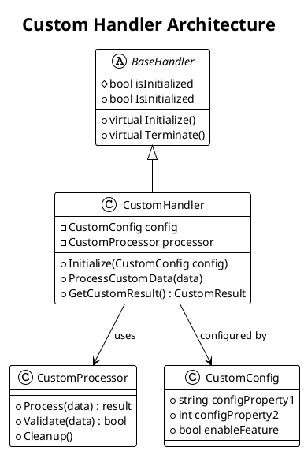

# Creating Custom Handlers

This guide provides step-by-step instructions for creating custom handlers in WebVerse-Runtime, including best practices, examples, and integration patterns.

## Overview

Custom handlers allow you to extend WebVerse-Runtime with specialized functionality for processing specific content types, managing resources, or providing new APIs. All handlers follow a consistent architecture based on the `BaseHandler` class.



## Step-by-Step Handler Creation

### Step 1: Define Handler Requirements

Before creating a handler, define:

1. **Purpose**: What specific functionality will this handler provide?
2. **Input/Output**: What data types will it process?
3. **Dependencies**: What other handlers or systems does it depend on?
4. **Configuration**: What configuration options are needed?
5. **APIs**: What JavaScript APIs should be exposed?

### Step 2: Create the Handler Class

```csharp
using FiveSQD.WebVerse.Utilities;
using UnityEngine;
using System;
using System.Collections.Generic;

namespace MyProject.Handlers
{
    /// <summary>
    /// Custom handler for processing audio content
    /// </summary>
    public class AudioHandler : BaseHandler
    {
        [Header("Audio Handler Configuration")]
        [SerializeField] private string audioDirectory = "Audio";
        [SerializeField] private int maxSimultaneousAudio = 10;
        [SerializeField] private float masterVolume = 1.0f;
        [SerializeField] private bool enableSpatialAudio = true;
        
        // Private members
        private Dictionary<string, AudioClip> audioCache;
        private List<AudioSource> audioSources;
        private AudioProcessor processor;
        
        // Events
        public event Action<string> OnAudioLoaded;
        public event Action<string> OnAudioPlayStarted;
        public event Action<string> OnAudioPlayFinished;
        
        /// <summary>
        /// Initialize the Audio Handler
        /// </summary>
        public override void Initialize()
        {
            try
            {
                // Validate configuration
                if (!ValidateConfiguration())
                {
                    Logging.LogError("[AudioHandler] Invalid configuration");
                    return;
                }
                
                // Initialize internal systems
                InitializeAudioSystem();
                
                // Set up dependencies
                SetupDependencies();
                
                // Call base initialization
                base.Initialize();
                
                Logging.Log("[AudioHandler] Initialized successfully");
            }
            catch (Exception ex)
            {
                Logging.LogError($"[AudioHandler] Initialization failed: {ex.Message}");
                throw new InitializationException("AudioHandler", ex.Message);
            }
        }
        
        /// <summary>
        /// Terminate the Audio Handler
        /// </summary>
        public override void Terminate()
        {
            try
            {
                // Stop all playing audio
                StopAllAudio();
                
                // Cleanup resources
                CleanupAudioSystem();
                
                // Clear caches
                ClearCaches();
                
                // Call base termination
                base.Terminate();
                
                Logging.Log("[AudioHandler] Terminated successfully");
            }
            catch (Exception ex)
            {
                Logging.LogError($"[AudioHandler] Termination error: {ex.Message}");
            }
        }
        
        // Public API methods
        public void LoadAudio(string audioPath, Action<AudioClip> onComplete)
        {
            if (!IsInitialized)
            {
                Logging.LogError("[AudioHandler] Handler not initialized");
                onComplete?.Invoke(null);
                return;
            }
            
            // Check cache first
            if (audioCache.ContainsKey(audioPath))
            {
                onComplete?.Invoke(audioCache[audioPath]);
                return;
            }
            
            // Load audio asynchronously
            processor.LoadAudioAsync(audioPath, (clip) =>
            {
                if (clip != null)
                {
                    audioCache[audioPath] = clip;
                    OnAudioLoaded?.Invoke(audioPath);
                }
                onComplete?.Invoke(clip);
            });
        }
        
        public void PlayAudio(string audioPath, Vector3 position = default, float volume = 1.0f)
        {
            LoadAudio(audioPath, (clip) =>
            {
                if (clip != null)
                {
                    PlayAudioClip(clip, position, volume);
                }
            });
        }
        
        public void StopAudio(string audioPath)
        {
            var source = audioSources.Find(s => s.clip != null && s.clip.name == audioPath);
            if (source != null && source.isPlaying)
            {
                source.Stop();
                OnAudioPlayFinished?.Invoke(audioPath);
            }
        }
        
        // Private implementation methods
        private bool ValidateConfiguration()
        {
            if (string.IsNullOrEmpty(audioDirectory))
            {
                Logging.LogError("[AudioHandler] Audio directory not specified");
                return false;
            }
            
            if (maxSimultaneousAudio <= 0)
            {
                Logging.LogError("[AudioHandler] Invalid maxSimultaneousAudio value");
                return false;
            }
            
            if (masterVolume < 0 || masterVolume > 1)
            {
                Logging.LogWarning("[AudioHandler] masterVolume outside recommended range (0-1)");
            }
            
            return true;
        }
        
        private void InitializeAudioSystem()
        {
            // Initialize audio cache
            audioCache = new Dictionary<string, AudioClip>();
            
            // Create audio sources pool
            audioSources = new List<AudioSource>();
            for (int i = 0; i < maxSimultaneousAudio; i++)
            {
                var sourceGO = new GameObject($"AudioSource_{i}");
                sourceGO.transform.SetParent(transform);
                var source = sourceGO.AddComponent<AudioSource>();
                source.spatialBlend = enableSpatialAudio ? 1.0f : 0.0f;
                audioSources.Add(source);
            }
            
            // Initialize processor
            processor = new AudioProcessor(audioDirectory);
        }
        
        private void SetupDependencies()
        {
            // Find and validate required dependencies
            var fileHandler = FindObjectOfType<FileHandler>();
            if (fileHandler == null || !fileHandler.IsInitialized)
            {
                throw new DependencyException("AudioHandler requires FileHandler");
            }
            
            // Set up dependency relationships
            processor.SetFileHandler(fileHandler);
        }
        
        private void PlayAudioClip(AudioClip clip, Vector3 position, float volume)
        {
            var availableSource = audioSources.Find(s => !s.isPlaying);
            if (availableSource == null)
            {
                Logging.LogWarning("[AudioHandler] No available audio source");
                return;
            }
            
            availableSource.clip = clip;
            availableSource.volume = volume * masterVolume;
            availableSource.transform.position = position;
            availableSource.Play();
            
            OnAudioPlayStarted?.Invoke(clip.name);
            
            // Schedule finish callback
            StartCoroutine(WaitForAudioFinish(availableSource, clip.name));
        }
        
        private System.Collections.IEnumerator WaitForAudioFinish(AudioSource source, string audioName)
        {
            yield return new WaitWhile(() => source.isPlaying);
            OnAudioPlayFinished?.Invoke(audioName);
        }
        
        private void StopAllAudio()
        {
            foreach (var source in audioSources)
            {
                if (source.isPlaying)
                {
                    source.Stop();
                }
            }
        }
        
        private void CleanupAudioSystem()
        {
            if (audioSources != null)
            {
                foreach (var source in audioSources)
                {
                    if (source != null && source.gameObject != null)
                    {
                        DestroyImmediate(source.gameObject);
                    }
                }
                audioSources.Clear();
            }
            
            processor?.Dispose();
        }
        
        private void ClearCaches()
        {
            audioCache?.Clear();
        }
    }
}
```

### Step 3: Create Supporting Classes

```csharp
// Audio processor class
public class AudioProcessor : IDisposable
{
    private string audioDirectory;
    private FileHandler fileHandler;
    
    public AudioProcessor(string audioDirectory)
    {
        this.audioDirectory = audioDirectory;
    }
    
    public void SetFileHandler(FileHandler fileHandler)
    {
        this.fileHandler = fileHandler;
    }
    
    public void LoadAudioAsync(string audioPath, Action<AudioClip> onComplete)
    {
        var fullPath = Path.Combine(audioDirectory, audioPath);
        
        if (!fileHandler.FileExistsInFileDirectory(fullPath))
        {
            Logging.LogError($"[AudioProcessor] Audio file not found: {fullPath}");
            onComplete?.Invoke(null);
            return;
        }
        
        // Use Unity's audio loading system
        StartCoroutine(LoadAudioCoroutine(fullPath, onComplete));
    }
    
    private System.Collections.IEnumerator LoadAudioCoroutine(string path, Action<AudioClip> onComplete)
    {
        var fullSystemPath = fileHandler.GetFullPath(path);
        using (var www = UnityWebRequestMultimedia.GetAudioClip($"file://{fullSystemPath}", AudioType.UNKNOWN))
        {
            yield return www.SendWebRequest();
            
            if (www.result == UnityWebRequest.Result.Success)
            {
                var clip = DownloadHandlerAudioClip.GetContent(www);
                onComplete?.Invoke(clip);
            }
            else
            {
                Logging.LogError($"[AudioProcessor] Failed to load audio: {www.error}");
                onComplete?.Invoke(null);
            }
        }
    }
    
    public void Dispose()
    {
        // Cleanup resources
        audioDirectory = null;
        fileHandler = null;
    }
}

// Custom exception types
public class DependencyException : Exception
{
    public DependencyException(string message) : base(message) { }
}
```

### Step 4: Register with WebVerse Runtime

```csharp
// In WebVerseRuntime or a custom initialization script
public class CustomHandlerRegistration : MonoBehaviour
{
    void Start()
    {
        RegisterCustomHandlers();
    }
    
    void RegisterCustomHandlers()
    {
        // Create handler GameObject
        var audioHandlerGO = new GameObject("AudioHandler");
        audioHandlerGO.transform.SetParent(transform);
        
        // Add and initialize handler
        var audioHandler = audioHandlerGO.AddComponent<AudioHandler>();
        audioHandler.Initialize();
        
        // Register handler for access by other systems
        HandlerRegistry.RegisterHandler("AudioHandler", audioHandler);
        
        Logging.Log("Custom AudioHandler registered successfully");
    }
}
```

## JavaScript API Integration

### Step 5: Create JavaScript API Bindings

```csharp
// JavaScript API helper class
public class AudioAPIHelper : MonoBehaviour
{
    private AudioHandler audioHandler;
    
    void Start()
    {
        audioHandler = FindObjectOfType<AudioHandler>();
        
        // Register JavaScript APIs
        var jsHandler = FindObjectOfType<JavaScriptHandler>();
        if (jsHandler != null)
        {
            jsHandler.RegisterAPI("Audio", typeof(AudioAPI));
        }
    }
}

// JavaScript-accessible API class
public static class AudioAPI
{
    public static void PlayAudio(string audioPath, float volume = 1.0f)
    {
        var handler = FindObjectOfType<AudioHandler>();
        if (handler != null && handler.IsInitialized)
        {
            handler.PlayAudio(audioPath, Vector3.zero, volume);
        }
        else
        {
            Logging.LogError("AudioHandler not available");
        }
    }
    
    public static void PlayAudioAtPosition(string audioPath, Vector3 position, float volume = 1.0f)
    {
        var handler = FindObjectOfType<AudioHandler>();
        if (handler != null && handler.IsInitialized)
        {
            handler.PlayAudio(audioPath, position, volume);
        }
    }
    
    public static void StopAudio(string audioPath)
    {
        var handler = FindObjectOfType<AudioHandler>();
        if (handler != null && handler.IsInitialized)
        {
            handler.StopAudio(audioPath);
        }
    }
    
    public static void SetMasterVolume(float volume)
    {
        var handler = FindObjectOfType<AudioHandler>();
        if (handler != null && handler.IsInitialized)
        {
            // Implement master volume setting
            handler.masterVolume = Mathf.Clamp01(volume);
        }
    }
}
```

### JavaScript Usage Example

```javascript
// JavaScript code using the custom Audio API
function setupAudioSystem() {
    // Set master volume
    Audio.SetMasterVolume(0.8);
    
    // Play background music
    Audio.PlayAudio("music/background.mp3", 0.5);
    
    // Play sound effect at specific position
    var position = new Vector3(10, 0, 5);
    Audio.PlayAudioAtPosition("effects/explosion.wav", position, 1.0);
}

// Event handlers
Input.onKeyDown = function(key) {
    switch(key) {
        case "1":
            Audio.PlayAudio("effects/beep.wav");
            break;
        case "2":
            Audio.StopAudio("music/background.mp3");
            break;
    }
};

// Initialize audio when scene loads
World.onReady = function() {
    setupAudioSystem();
};
```

## Advanced Handler Patterns

### Handler with Configuration File

```csharp
[System.Serializable]
public class AudioHandlerConfig
{
    public string audioDirectory = "Audio";
    public int maxSimultaneousAudio = 10;
    public float masterVolume = 1.0f;
    public bool enableSpatialAudio = true;
    public AudioCompressionFormat compressionFormat = AudioCompressionFormat.Vorbis;
    public int audioQuality = 70;
}

public class ConfigurableAudioHandler : BaseHandler
{
    [SerializeField] private string configFilePath = "config/audio-config.json";
    private AudioHandlerConfig config;
    
    public override void Initialize()
    {
        LoadConfiguration();
        InitializeWithConfig();
        base.Initialize();
    }
    
    private void LoadConfiguration()
    {
        try
        {
            var fileHandler = FindObjectOfType<FileHandler>();
            if (fileHandler.FileExistsInFileDirectory(configFilePath))
            {
                var configText = File.ReadAllText(fileHandler.GetFullPath(configFilePath));
                config = JsonUtility.FromJson<AudioHandlerConfig>(configText);
            }
            else
            {
                config = new AudioHandlerConfig(); // Use defaults
                SaveConfiguration(); // Save default config
            }
        }
        catch (Exception ex)
        {
            Logging.LogError($"[AudioHandler] Failed to load config: {ex.Message}");
            config = new AudioHandlerConfig();
        }
    }
    
    private void SaveConfiguration()
    {
        try
        {
            var configText = JsonUtility.ToJson(config, true);
            var fileHandler = FindObjectOfType<FileHandler>();
            File.WriteAllText(fileHandler.GetFullPath(configFilePath), configText);
        }
        catch (Exception ex)
        {
            Logging.LogError($"[AudioHandler] Failed to save config: {ex.Message}");
        }
    }
}
```

### Handler with Event System Integration

```csharp
public class EventDrivenAudioHandler : BaseHandler
{
    // Subscribe to WebVerse events
    void Start()
    {
        // Listen for entity events
        EntitySystem.OnEntityCreated += OnEntityCreated;
        EntitySystem.OnEntityDestroyed += OnEntityDestroyed;
        
        // Listen for VEML events
        VEMLSystem.OnDocumentLoaded += OnVEMLLoaded;
        
        // Listen for input events
        InputSystem.OnKeyPressed += OnKeyPressed;
    }
    
    void OnDestroy()
    {
        // Unsubscribe from events
        EntitySystem.OnEntityCreated -= OnEntityCreated;
        EntitySystem.OnEntityDestroyed -= OnEntityDestroyed;
        VEMLSystem.OnDocumentLoaded -= OnVEMLLoaded;
        InputSystem.OnKeyPressed -= OnKeyPressed;
    }
    
    private void OnEntityCreated(Entity entity)
    {
        // Play creation sound based on entity type
        string soundEffect = GetSoundForEntityType(entity.type);
        if (!string.IsNullOrEmpty(soundEffect))
        {
            PlayAudio(soundEffect, entity.position);
        }
    }
    
    private void OnVEMLLoaded(string vemlPath)
    {
        // Play ambient audio defined in VEML
        LoadAmbientAudioFromVEML(vemlPath);
    }
    
    private void OnKeyPressed(string key)
    {
        // Play UI sound effects
        if (key == "Enter" || key == "Space")
        {
            PlayAudio("ui/button-click.wav");
        }
    }
}
```

## Testing Custom Handlers

### Unit Testing

```csharp
using NUnit.Framework;
using UnityEngine;
using UnityEngine.TestTools;
using System.Collections;

[TestFixture]
public class AudioHandlerTests
{
    private AudioHandler audioHandler;
    private GameObject testObject;
    
    [SetUp]
    public void Setup()
    {
        testObject = new GameObject("TestAudioHandler");
        audioHandler = testObject.AddComponent<AudioHandler>();
    }
    
    [TearDown]
    public void Teardown()
    {
        if (audioHandler != null && audioHandler.IsInitialized)
        {
            audioHandler.Terminate();
        }
        
        if (testObject != null)
        {
            Object.DestroyImmediate(testObject);
        }
    }
    
    [Test]
    public void AudioHandler_Initialize_SetsInitializedTrue()
    {
        // Arrange & Act
        audioHandler.Initialize();
        
        // Assert
        Assert.IsTrue(audioHandler.IsInitialized);
    }
    
    [UnityTest]
    public IEnumerator AudioHandler_LoadAudio_LoadsAudioClip()
    {
        // Arrange
        audioHandler.Initialize();
        AudioClip loadedClip = null;
        bool callbackExecuted = false;
        
        // Act
        audioHandler.LoadAudio("test-audio.wav", (clip) =>
        {
            loadedClip = clip;
            callbackExecuted = true;
        });
        
        // Wait for async operation
        yield return new WaitUntil(() => callbackExecuted);
        
        // Assert
        Assert.IsNotNull(loadedClip);
        Assert.AreEqual("test-audio", loadedClip.name);
    }
    
    [Test]
    public void AudioHandler_PlayAudio_WithInvalidPath_DoesNotThrow()
    {
        // Arrange
        audioHandler.Initialize();
        
        // Act & Assert
        Assert.DoesNotThrow(() => audioHandler.PlayAudio("nonexistent.wav"));
    }
}
```

### Integration Testing

```csharp
[TestFixture]
public class AudioHandlerIntegrationTests
{
    [UnityTest]
    public IEnumerator AudioHandler_IntegratesWithJavaScript_ExecutesSuccessfully()
    {
        // Setup WebVerse runtime environment
        var runtime = SetupWebVerseRuntime();
        yield return new WaitUntil(() => runtime.IsInitialized);
        
        // Execute JavaScript that uses Audio API
        var jsHandler = runtime.GetHandler<JavaScriptHandler>();
        string jsCode = "Audio.PlayAudio('test-sound.wav', 0.5);";
        
        object result = null;
        jsHandler.ExecuteScriptAsync(jsCode, (res) => result = res);
        
        yield return new WaitUntil(() => result != null);
        
        // Verify audio system responded correctly
        var audioHandler = runtime.GetHandler<AudioHandler>();
        Assert.IsTrue(audioHandler.IsAudioPlaying("test-sound.wav"));
    }
}
```

## Deployment and Distribution

### Assembly Definition

Create an assembly definition file for your custom handler:

```json
{
    "name": "MyProject.CustomHandlers",
    "rootNamespace": "MyProject.Handlers",
    "references": [
        "FiveSQD.WebVerse",
        "FiveSQD.WebVerse.Utilities"
    ],
    "includePlatforms": [],
    "excludePlatforms": [],
    "allowUnsafeCode": false,
    "overrideReferences": false,
    "precompiledReferences": [],
    "autoReferenced": true,
    "defineConstraints": [],
    "versionDefines": [],
    "noEngineReferences": false
}
```

### Package Structure

```
MyCustomHandlers/
├── Runtime/
│   ├── Scripts/
│   │   ├── AudioHandler.cs
│   │   ├── AudioProcessor.cs
│   │   └── AudioAPIHelper.cs
│   ├── MyProject.CustomHandlers.asmdef
│   └── package.json
├── Tests/
│   ├── Runtime/
│   │   ├── AudioHandlerTests.cs
│   │   └── MyProject.CustomHandlers.Tests.asmdef
│   └── Editor/
├── Documentation~/
│   ├── AudioHandler.md
│   └── API-Reference.md
└── README.md
```

### Package.json

```json
{
  "name": "com.mycompany.webverse-audio-handler",
  "version": "1.0.0",
  "displayName": "WebVerse Audio Handler",
  "description": "Custom audio handler for WebVerse-Runtime",
  "unity": "2021.3",
  "dependencies": {
    "com.fivesqd.webverse": "1.0.0"
  },
  "keywords": [
    "webverse",
    "audio",
    "handler",
    "custom"
  ],
  "author": {
    "name": "Your Name",
    "email": "your.email@example.com"
  }
}
```

## Best Practices Summary

1. **Follow Naming Conventions**: Use descriptive names and consistent patterns
2. **Implement Proper Error Handling**: Always handle exceptions gracefully
3. **Validate Dependencies**: Check for required components during initialization
4. **Use Async Patterns**: Implement async operations for file I/O and network requests
5. **Provide Configuration Options**: Make handlers configurable through serialized fields or config files
6. **Document Your APIs**: Provide clear documentation and examples
7. **Write Tests**: Create comprehensive unit and integration tests
8. **Handle Cleanup**: Properly dispose of resources in Terminate()
9. **Follow Unity Patterns**: Use coroutines, component patterns, and Unity lifecycle
10. **Expose JavaScript APIs**: Make functionality accessible to VEML scripts

This comprehensive guide provides everything needed to create robust, well-integrated custom handlers for WebVerse-Runtime.