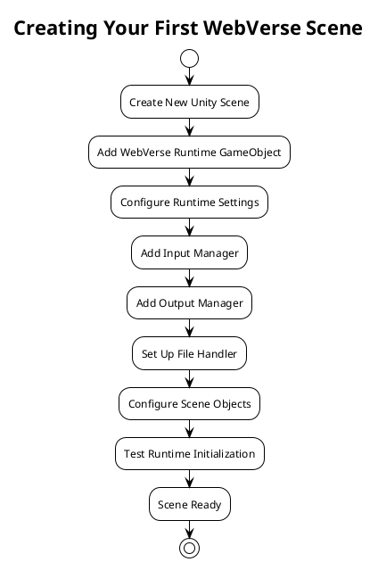

# Getting Started with WebVerse-Runtime

This guide will help you quickly set up and start using WebVerse-Runtime to create immersive virtual environments.

## Prerequisites

Before you begin, ensure you have the following installed:

- **Unity 2021.3.26** or later with Universal Render Pipeline
- **Git** for version control
- **Text Editor** or IDE for script editing

### Required Unity Asset Store Packages

WebVerse-Runtime requires the following paid Asset Store packages:

- [Best HTTP v3.0.4](https://assetstore.unity.com/packages/tools/network/best-http-267636)
- [Best MQTT v3.0.2](https://assetstore.unity.com/packages/tools/network/best-mqtt-268762)  
- [Best WebSockets v3.0.1](https://assetstore.unity.com/packages/tools/network/best-websockets-268757)

## Quick Start

### Step 1: Clone the Repository

```bash
git clone https://github.com/Five-Squared-Interactive/WebVerse-Runtime.git
cd WebVerse-Runtime
```

### Step 2: Open in Unity

1. Launch Unity Hub
2. Click "Open" and select the `WebVerse-Runtime` folder
3. Unity will import the project (this may take several minutes)

**Note**: You will see compilation errors until the Asset Store packages are imported.

### Step 3: Import Asset Store Packages

1. Open the Unity Package Manager (Window → Package Manager)
2. Change the scope to "My Assets"
3. Import each required package:
   - Best HTTP v3.0.4
   - Best MQTT v3.0.2
   - Best WebSockets v3.0.1

### Step 4: Verify Installation

After importing all packages, verify that there are no compilation errors in the Console window.

## Your First WebVerse Scene

### Create a Basic Scene



1. **Create a new scene** (File → New Scene → Basic (URP))

2. **Add WebVerse Runtime**:
   - Create an empty GameObject and name it "WebVerse"
   - Add the `WebVerseRuntime` script component
   - Configure the basic settings:

```csharp
// Basic WebVerse Runtime Configuration
Storage Mode: Persistent
Max Storage Entries: 1000
Max Entry Length: 10000
Files Directory: "WebVerseFiles"
```

3. **Set up Input**:
   - Create a child GameObject named "InputManager"
   - Add platform-specific input components (Desktop/VR)

4. **Add a test VEML file**:
   Create a simple VEML document to test loading:

```xml
<?xml version="1.0" encoding="UTF-8"?>
<veml xmlns="http://www.fivesqd.com/schemas/veml/3.0" version="3.0">
    <metadata>
        <title>My First WebVerse Scene</title>
        <description>A simple test scene</description>
    </metadata>
    <environment>
        <background>
            <color>skyblue</color>
        </background>
        <entity id="ground" type="plane">
            <transform>
                <position x="0" y="0" z="0"/>
                <scale x="10" y="1" z="10"/>
            </transform>
            <color>green</color>
        </entity>
        <entity id="cube" type="cube">
            <transform>
                <position x="0" y="1" z="0"/>
            </transform>
            <color>red</color>
        </entity>
    </environment>
</veml>
```

### Test Your Scene

1. **Play the scene** by clicking the Play button in Unity
2. **Check the Console** for initialization messages
3. **Verify** that WebVerse components are initialized correctly

Expected console output:
```
[WebVerseRuntime] Initializing WebVerse-Runtime
[FileHandler] Using file directory: [path]/WebVerseFiles
[FileHandler] Initialized
[VEMLHandler] Initialized
[JavaScriptHandler] Initialized
[WebVerseRuntime] Initialization complete
```

## Basic Usage Examples

### Loading VEML Content

```javascript
// JavaScript example for loading VEML content
function loadScene() {
    // Load a VEML document
    VEML.loadDocument("scenes/example.veml", function(success) {
        if (success) {
            Logging.Log("Scene loaded successfully");
        } else {
            Logging.LogError("Failed to load scene");
        }
    });
}

// Call when runtime is ready
World.onReady = function() {
    loadScene();
};
```

### Creating Entities Programmatically

```javascript
// Create a simple cube entity
function createCube() {
    var cube = Entity.create("MyCube");
    cube.addComponent("MeshRenderer");
    cube.addComponent("BoxCollider");
    
    // Set position
    cube.position = new Vector3(0, 1, 0);
    
    // Set color
    var material = { color: Color.blue };
    cube.setMaterial(material);
    
    return cube;
}

// Create multiple objects
function createTestScene() {
    // Ground plane
    var ground = Entity.create("Ground");
    ground.addComponent("MeshRenderer");
    ground.position = new Vector3(0, 0, 0);
    ground.localScale = new Vector3(10, 1, 10);
    
    // Some cubes
    for (var i = 0; i < 5; i++) {
        var cube = createCube();
        cube.position = new Vector3(i * 2 - 4, 1, 0);
        cube.name = "Cube" + i;
    }
}

// Execute when scene starts
createTestScene();
```

### Handling User Input

```javascript
// Set up input handlers
Input.onKeyDown = function(key) {
    switch(key) {
        case "W":
            Logging.Log("Moving forward");
            // Move player forward
            break;
        case "S":
            Logging.Log("Moving backward");
            // Move player backward
            break;
        case "Space":
            Logging.Log("Jump!");
            // Make player jump
            break;
    }
};

Input.onMouseDown = function(button, position) {
    Logging.Log("Mouse clicked at: " + position);
    
    // Perform raycast from mouse position
    var ray = Camera.screenPointToRay(position);
    var hit = Physics.raycast(ray);
    
    if (hit.collider) {
        Logging.Log("Hit object: " + hit.collider.gameObject.name);
        // Interact with clicked object
    }
};
```

## Common Configuration Patterns

### Development Configuration

For development, use these settings for better debugging:

```csharp
// WebVerse Runtime settings for development
[Header("Development Settings")]
public bool enableDebugLogging = true;
public bool enablePerformanceMonitoring = true;
public float javascriptExecutionTimeout = 1000f;  // 1 second timeout
public bool validateVEMLDocuments = true;
```

### Production Configuration

For production builds, optimize for performance:

```csharp
// WebVerse Runtime settings for production
[Header("Production Settings")]
public bool enableDebugLogging = false;
public bool enablePerformanceMonitoring = false;
public float javascriptExecutionTimeout = 100f;   // 100ms timeout
public bool validateVEMLDocuments = false;        // Skip validation for speed
```

## Platform-Specific Setup

### Desktop Setup

```csharp
// Desktop-specific configuration
[Header("Desktop Settings")]
public bool enableMouseInput = true;
public bool enableKeyboardInput = true;
public float mouseSensitivity = 2.0f;
public bool invertMouseY = false;
```

### VR Setup

```csharp
// VR-specific configuration  
[Header("VR Settings")]
public bool enableVRInput = true;
public Transform leftController;
public Transform rightController;
public Transform headset;
public float controllerSensitivity = 1.0f;
```

### WebGL Setup

For WebGL builds, configure memory limits:

```csharp
// WebGL-specific configuration
[Header("WebGL Settings")]
public int maxMemoryUsageMB = 512;        // Limited memory on web
public bool enableAsyncFileLoading = true;
public int maxConcurrentDownloads = 3;    // Limit concurrent requests
```

## Troubleshooting

### Common Issues

#### Compilation Errors
```
CS0246: The type or namespace name 'BestHTTP' could not be found
```
**Solution**: Import the required Asset Store packages (Best HTTP, Best MQTT, Best WebSockets)

#### File Access Errors
```
[FileHandler] Failed to create directory: Access denied
```
**Solution**: Check file permissions and ensure the target directory is writable

#### JavaScript Execution Errors
```
[JavaScriptHandler] Script execution timeout
```
**Solution**: Optimize JavaScript code or increase the execution timeout setting

#### VEML Loading Errors
```
[VEMLHandler] Invalid VEML schema version
```
**Solution**: Update VEML document to supported version (3.0) or enable legacy conversion

### Debug Tools

#### Enable Verbose Logging
```csharp
// Add to WebVerse Runtime initialization
Logging.SetLogLevel(LogLevel.Verbose);
Logging.EnableConsoleOutput(true);
```

#### Performance Monitoring
```csharp
// Enable performance profiling
public bool enableMemoryProfiling = true;
public bool enableFrameRateMonitoring = true;
public bool logPerformanceMetrics = true;
```

#### Component Status Check
```javascript
// JavaScript function to check component status
function checkSystemStatus() {
    Logging.Log("=== WebVerse System Status ===");
    Logging.Log("Runtime initialized: " + WebVerseRuntime.isInitialized);
    Logging.Log("File handler ready: " + FileHandler.isReady);
    Logging.Log("VEML handler ready: " + VEMLHandler.isReady);
    Logging.Log("JavaScript handler ready: " + JavaScriptHandler.isReady);
    Logging.Log("Storage available: " + LocalStorage.isAvailable);
    Logging.Log("===============================");
}

// Call periodically or on demand
checkSystemStatus();
```

## Next Steps

Now that you have WebVerse-Runtime set up and running:

1. **Explore the API Documentation**: Learn about available JavaScript APIs
2. **Study Example Scenes**: Examine the provided sample scenes
3. **Create Custom Handlers**: Extend functionality with custom handlers
4. **Build and Deploy**: Create builds for your target platforms
5. **Join the Community**: Connect with other WebVerse developers

### Learning Resources

- [Architecture Documentation](./architecture/README.md) - Understand the system design
- [API Reference](./api/javascript-api.md) - Complete API documentation
- [Configuration Guide](./configuration/runtime.md) - Advanced configuration options
- [Examples](./examples/basic-usage.md) - Practical usage examples
- [Contributing Guidelines](./developer/contributing.md) - How to contribute to the project

### Sample Projects

Try these progressive examples:

1. **Basic Scene**: Static VEML content loading
2. **Interactive Scene**: User input and entity manipulation
3. **Dynamic Content**: Runtime content generation and modification
4. **Networked Scene**: Multi-user synchronization with VOS
5. **Custom Handlers**: Extending functionality with plugins

Congratulations! You're now ready to start building immersive virtual environments with WebVerse-Runtime.